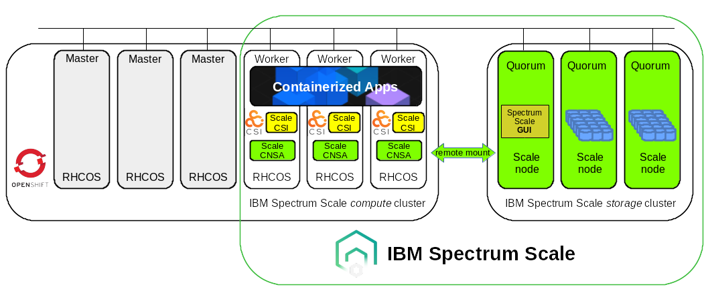

# Helm Chart Deployment of IBM Spectrum Scale CNSA/CSI

## Table of Contents

- [Abstract](#abstract)
- [Architecture](#architecture)
- [Requirements](#requirements)
- [Repository structure](#repository-structure)
- [Preinstallation tasks](#preinstallation-tasks)
  - [Add IBM Cloud Container Registry entitlement to OpenShift global cluster pull secret](#add-ibm-cloud-container-registry-entitlement-to-openshift-global-cluster-pull-secret)
  - [Prepare OpenShift worker nodes to run IBM Spectrum Scale](#prepare-openshift-worker-nodes-to-run-ibm-spectrum-scale)
  - [Label OpenShift worker nodes for IBM Spectrum Scale](#label-openshift-worker-nodes-for-ibm-spectrum-scale)
  - [Prepare remote IBM Spectrum Scale storage cluster](#prepare-remote-ibm-spectrum-scale-storage-cluster)
- [Deployment steps](#deployment-steps)
  - [(STEP 1) Prepare IBM Spectrum Scale *GUI users* and OpenShift *namespaces* and *secrets*](#step1)
    - Create GUI user for IBM Spectrum Scale CNSA on the remote storage cluster
    - Create GUI user for IBM Spectrum Scale CSI driver on the remote storage cluster
    - Prepare namespaces for IBM Spectrum Scale CNSA and CSI driver in OpenShift
    - Create secret for IBM Spectrum Scale CNSA user credentials (remote cluster)
    - Create secrets for IBM Spectrum Scale CSI driver user credentials (remote & local cluster)
    - Verify access to the GUI of the remote IBM Spectrum Scale storage cluster
  - [(STEP 2) Edit the *config.yaml* file to reflect your local environment](#step2)
    - Minimum required configuration
    - Extended configuration
    - Optional configuration parameters
      - Call home (optional)
      - Hostname aliases (optional)
  - [(STEP 3) Deploy the IBM Spectrum Scale CNSA Helm Chart (*ibm-spectrum-scale*)](#step3)
    - [CNSA Helm Chart Hooks](#cnsa-helm-chart-hooks)
  - [(STEP 4) Deploy IBM Spectrum Scale CSI driver Helm Chart (*ibm-spectrum-scale-csi*)](#step4)
    - [CSI Helm Chart Hooks](#csi-helm-chart-hooks)
- [Remove IBM Spectrum Scale CNSA and CSI deployment](#remove-ibm-spectrum-scale-cnsa-and-csi-deployment)
- [Deploy IBM Spectrum Scale CNSA and CSI driver using Helm chart templating](#deploy-ibm-spectrum-scale-cnsa-and-csi-driver-using-helm-chart-templating)
- [Example of using IBM Spectrum Scale provisioned storage](#example-of-using-ibm-spectrum-scale-provisioned-storage)
- [Additional configuration options](#additional-configuration-options)
  - Specify node labels for IBM Spectrum Scale CNSA (optional)
  - Specify node labels for IBM Spectrum Scale CSI driver (optional)
  - Specify pod tolerations for IBM Spectrum Scale CSI driver (optional)
  - Specify node mappings for IBM Spectrum Scale CSI driver (optional)


## Abstract

This document describes the combined deployment of

- [*IBM Spectrum Scale Container Native Storage Access* (CNSA) v5.1.1.1](https://www.ibm.com/docs/en/scalecontainernative?topic=spectrum-scale-container-native-storage-access-5111) and 
- [*IBM Spectrum Scale CSI driver* v2.2.0](https://www.ibm.com/docs/en/spectrum-scale-csi?topic=spectrum-scale-container-storage-interface-driver-220) 

using *two* Helm charts with a *single* configuration file ([*config.yaml*](config.yaml)).

The installation of the IBM Spectrum Scale® CNSA with IBM Spectrum Scale® CSI driver on Red Hat® OpenShift® requires two distinct installation steps because
a few manual steps need to be performed *after* the IBM Spectrum Scale® CNSA deployment and 
*prior* to the IBM Spectrum Scale® CSI driver deployment.

If you have already prepared all pre-installation tasks from the official IBM Documentation and meet all the requirements listed in
[Requirements](#requirements) then you can directly continue with the installation steps in [Deployment steps](#deployment-steps).


## Architecture

IBM Spectrum Scale® in containers allows the deployment of the cluster file system in a Red Hat® OpenShift® cluster. 
Using a remote mount attached file system, the IBM Spectrum Scale solution provides a persistent data store to be accessed by the applications 
via the IBM Spectrum Scale Container Storage Interface (CSI) driver using Persistent Volumes (PVs).

IBM Spectrum Scale CNSA will be running on the OpenShift cluster and be referred to as local IBM Spectrum Scale *compute* cluster.
The physical storage is provided by the remote IBM Spectrum Scale *storage* cluster 
(e.g. an [IBM Elastic Storage System](https://www.ibm.com/products/elastic-storage-system))
using a remote mount of an IBM Spectrum Scale file system.




## Requirements

To install 
[*IBM Spectrum Scale CNSA*](https://www.ibm.com/docs/en/scalecontainernative?topic=spectrum-scale-container-native-storage-access-5111) and 
[*IBM Spectrum Scale CSI driver*](https://www.ibm.com/docs/en/spectrum-scale-csi?topic=spectrum-scale-container-storage-interface-driver-220) 
with these Helm charts on Red Hat OpenShift 4.6 (or higher) the following requirements need to be met together
with the regular pre-requisites for IBM Spectrum Scale CNSA and CSI driver as described in their respective official IBM Documentation:

* Meet the official [Hardware and software requirements](https://www.ibm.com/docs/en/scalecontainernative?topic=planning-hardware-software-requirements).
* A Red Hat OpenShift Container Platform cluster, version 4.6.6 (or higher minor version) or 4.7 (recommended) with a minimum configuration 
  of *three* master nodes and *three* worker nodes (and a supported maximum of 128 worker nodes).
* The new *volume snapshot* functionality in IBM Spectrum Scale CSI driver v2.2.0 requires Red Hat OpenShift 4.7 and IBM Spectrum Scale version 5.1.1.0 as minimum versions.
* An IBM Spectrum Scale *storage* cluster running IBM Spectrum Scale version 5.1.0.3 or higher (ideally a minimum of 3 nodes) 
  with IBM Spectrum Scale GUI to provide a REST API for IBM Spectrum Scale CNSA and CSI driver.
  The *storage* cluster provides an IBM Spectrum Scale file system that backs the persistent storage in OpenShift. This file system 
  is mounted through a *remote mount* (also referred to as *cross-cluster mount*) on the local IBM Spectrum Scale CNSA *compute* cluster 
  and the OpenShift worker nodes as a clustered parallel file system.
  Note that all nodes of the local *compute* and remote *storage* cluster need to be able to communicate over the 
  IBM Spectrum Scale *daemon* network with each other (this is a prerequisite for the remote mount).
* IBM Spectrum Scale CNSA v5.1.1.1 supports IBM Spectrum Scale file system versions V24.00 (5.1.0.0) and V25 (5.1.1.0) for the remote mount (`mmlsfs <fs name> -V`.
  Should you upgrade the remote storage cluster beyond 5.1.1.x at some point, make sure to stay at a supported version of the file system
  for the remote mount by making use of `mmchfs <fs name> -V compat` to retain accessibility from the IBM Spectrum Scale CNSA compute cluster.
* Access to the IBM Cloud Container Registry is required, 
  see [Accessing IBM Cloud Container Registry](https://www.ibm.com/docs/en/scalecontainernative?topic=installation-accessing-cloud-container-registry),
  with an *entitlement key* for either *IBM Spectrum Scale Data Access Edition* or *IBM Spectrum Scale Data Management Edition*
  so that the *IBM Spectrum Scale Container Native Storage Access* operator can automatically pull the required images from the IBM Cloud Container Registry (icr.io). 
* Modify the OpenShift *global pull secrets* to contain the credentials (entitled registry user: "**cp**" & your **entitlement key**) for accessing the IBM Cloud Container Registry.
  See [Red Hat OpenShift Container Platform global pull secret](https://www.ibm.com/docs/en/scalecontainernative?topic=installation-red-hat-openshift-container-platform-global-pull-secret)
  for instructions. Note that the updated config will be rolled out to all nodes in the OpenShift cluster one at a time and on OpenShift 4.6
  nodes will not be schedulable before rebooting. On OpenShift 4.7 and above the nodes do not need to reboot. Also see 
  [Updating the global cluster pull secret](https://docs.openshift.com/container-platform/4.7/openshift_images/managing_images/using-image-pull-secrets.html#images-update-global-pull-secret_using-image-pull-secrets). 
* Transport Layer Security (TLS) verification is used to guarantee secure HTTPS communication with the storage cluster GUI 
  by verifying the server's certificate chain and host name. Prepare for one of the *three* options described in
  [Configure Certificate Authority (CA) certificates for storage cluster](https://www.ibm.com/docs/en/scalecontainernative?topic=installation-configure-certificate-authority-ca-certificates-storage-cluster).
  Note that the storage cluster verification can be skipped (e.g. for PoCs, demos) by setting *insecureSkipVerify* option to *true*, see 
  [Edit the config.yaml file to reflect your local environment](#step2). This is the default used in the Helm chart deployment for PoCs. Recommended setting is *false*. 
* Clone the official [IBM Spectrum Scale CNSA v5.1.1.1 release](https://github.com/IBM/ibm-spectrum-scale-container-native/tree/v5.1.1.1) from the public Github repository to your local installation node.
* Clone [this](https://github.com/IBM/ibm-spectrum-scale-container-native-helm/tree/v5.1.1.1-v2.2.0) Github repository to your local installation node. 
* **helm v3** (or higher) needs to be installed on the local installation node, see [Installing Helm](https://helm.sh/docs/intro/install/) to apply the Helm charts.
* A cluster-wide admin user (*cluster-admin* role) on OpenShift is required for the deployment. The predefined `kube:admin` or `system:admin` accounts do suffice.
  See the [OPTIONAL NOTE](#clusteradmin) below for more information on how to create a *regular* OpenShift cluster-admin user.
* Internet access is required for the deployment so all required images for IBM Spectrum Scale CNSA and CSI driver can be accessed on the worker nodes
  from their respective external image registries, e.g. icr.io, quay.io, us.gcr.io, docker.io, registry.access.redhat.com, etc.
  For a list of required container images and registries see 
  [Container image list for IBM Spectrum® Scale Container Native Storage Access](https://www.ibm.com/docs/en/scalecontainernative?topic=planning-container-image-list-spectrum-scale-container-native-storage-access).
  and [Deployment considerations](https://www.ibm.com/docs/en/spectrum-scale-csi?topic=planning-deployment-considerations).
  See [Airgap setup for network restricted Red Hat OpenShift Container Platform clusters (optional)](https://www.ibm.com/docs/en/scalecontainernative?topic=appendix-airgap-setup-network-restricted-red-hat-openshift-container-platform-clusters)
  in case your OpenShift cluster does not allow access to external image registries. The Red Hat® OpenShift® internal image registry is no longer supported at this time. 
* Ensure that ports 1191, 443, and the ephemeral port ranges are open so IBM Spectrum Scale CNSA can remotely mount the file system from the storage cluster.
  See [Securing the IBM Spectrum Scale system using firewall](https://www.ibm.com/docs/en/spectrum-scale/5.1.1?topic=topics-securing-spectrum-scale-system-using-firewall) 
  for more information.

<a name="clusteradmin"></a>
*OPTIONAL NOTE* (not required for the deployment): A production-ready Red Hat OpenShift cluster would have a properly configured *identity provider* and a regular *cluster-admin* user 
other than the default admin users like `kube:admin` or `system:admin` which are meant primarily as temporary accounts for the initial deployment
and, for example, do not provide a token (`oc whoami -t`) to access and push images to the internal OpenShift image registry.
The steps to create such an OpenShift cluster-admin user include 
1. Adding an *identity provider* like *HTPasswd* to the OpenShift cluster 
(see [Configuring an HTPasswd identity provider](https://docs.openshift.com/container-platform/4.5/authentication/identity_providers/configuring-htpasswd-identity-provider.html))
and
2. Creating a regular admin user account with a *cluster-admin* role with 
(see [Creating a cluster admin](https://docs.openshift.com/container-platform/4.5/authentication/using-rbac.html#creating-cluster-admin_using-rbac))
```
# oc adm policy add-cluster-role-to-user cluster-admin <user-name>
```


## Repository structure

When cloning this repository you will find the following files in your local directory:
```
README.md
config.yaml           << one central configuration file with minimum required variables for the customer
helm/
 \-ibm-spectrum-scale
   |-Chart.yaml       << defines Helm chart version and provides additional info
   |-LICENSE
   |-values.yaml      << holds all configurable variables of the Helm chart / offers extended options
   |-crds/            << holds the custom resource definitions (CRD) for the IBM Spectrum Scale CNSA deployment
   |-templates/       << holds the templates of the YAML manifests for the IBM Spectrum Scale CNSA deployment
 \-ibm-spectrum-scale-csi
   |-Chart.yaml       << defines Helm chart version and provides additional info
   |-LICENSE
   |-values.yaml      << holds all configurable variables of the Helm chart / offers extended options
   |-crds/            << holds the custom resource definitions (CRD) for the IBM Spectrum Scale CSI driver deployment
   |-templates/       << holds the templates of the YAML manifests for the IBM Spectrum Scale CSI driver deployment
scripts/
 |- upload_images.sh  << script to upload local IBM Spectrum Scale CNSA v5.1.0.x images (from tar archive) to the OpenShift internal image registry
examples/
 |- ibm-spectrum-scale-sc.yaml         << storage class (SC) example for IBM Spectrum Scale CNSA
 |- ibm-spectrum-scale-pvc.yaml        << persistent volume claim (PVC) example for IBM Spectrum Scale CNSA
 |- ibm-spectrum-scale-test-pod.yaml   << test pod example for IBM Spectrum Scale CNSA
```
The **config.yaml** file describes the parameters for the local environment and needs to be edited by the administrator accordingly. 
It provides a single place with a *minimum set of variables* required for the combined deployment of *IBM Spectrum Scale CNSA* and IBM Spectrum Scale CSI driver*.

The two distinct Helm charts for the IBM Spectrum Scale CNSA and CSI driver deployment are located in the *helm/* directory 
as **ibm-spectrum-scale** and **ibm-spectrum-scale-csi**, respectively.

Each of these Helm charts consists of a default **values.yaml** file that defines the available *variables* and their *default values* which are
used in the YAML templates. The YAML templates can be found in the **templates/** directory.
In contrast to the **config.yaml** file each **values.yaml** file contains additional configuration variables with their default values 
which are more specific to the individual release packages of IBM Spectrum Scale CNSA and CSI driver, e.g. like specific image names or tags. 
These should not typically need to be edited by an end user for deployment. These **values.yaml** files are an inherent part of each Helm chart
and offer a great way for developers to quickly use the same Helm chart with different images and tags for development deployments without 
the need to edit individual YAML manifests manually.

The **crds/** directory stores the unchanged original *custom resource definitions* (CRDs) for the IBM Spectrum Scale CNSA and CSI driver releases 
which will not be templated by Helm. 

The **Chart.yaml** file describes the general properties of the Helm chart such as the Helm chart name, the *Helm chart version* and the *appVersion*.
The *appVersion* is used as the *default tag* for the images in the Helm chart if no other tag is explicitely defined for the container images in `values.yaml`,e.g.
**appVersion** *v2.2.0* for IBM Spectrum Scale CSI driver image tag *v2.2.0*.

The Helm charts are based on the original YAML manifests from the public IBM Github repositories:
- [IBM Spectrum Scale container native](https://github.com/IBM/ibm-spectrum-scale-container-native)
- [IBM Spectrum Scale CSI](https://github.com/IBM/ibm-spectrum-scale-csi)


## Preinstallation tasks

Be sure to perform all pre-installation tasks for the IBM Spectrum Scale CNSA and CSI driver deployment, e.g.
* [Configuring the Red Hat® OpenShift® Container Platform](https://www.ibm.com/docs/en/scalecontainernative?topic=installation-red-hat-openshift-container-platform-configuration)
  to increase the **PIDS_LIMIT**, add the **kernel-devel** extensions and 
  increase **vmalloc kernel parameter** (the latter is only required for *Linux on System Z*) and
* [Performing pre-installation tasks for CSI driver deployment](https://www.ibm.com/docs/en/scalecontainernative?topic=driver-performing-pre-installation-tasks-csi-deployment),
  to configure the remote storage cluster, for example, by setting the following options accordingly:
  ``` 
  -Q/quota, --perfileset-quota, --filesetdf, enforceFilesetQuotaOnRoot, controlSetxattrImmutableSELinux
  ```

### Add IBM Cloud Container Registry entitlement to OpenShift global cluster pull secret

With IBM Spectrum Scale Container Native Storage Access version 5.1.1.1, the container images have moved to the *IBM Cloud Container Registry* (icr.io).
You need to obtain an *entitlement key* from [IBM Container software library](https://myibm.ibm.com/products-services/containerlibrary) 
using an IBM id and a password that is associated with the entitled software. 
This *entitlement key* must be added to the *global cluster pull secret* of your OpenShift cluster 
otherwise the IBM Spectrum Scale pods (except the operator) will fail to start due to image pull failures:
```
Failed to pull image "cp.icr.io/cp/spectrum/scale/ibm-spectrum-scale-core-init@sha256:a346f70d89755fe94143686d058e2e09698e4d6bb663df172befd91d54c7ffd6": 
rpc error: code = Unknown desc = Requesting bear token: invalid status code from registry 400 (Bad Request)
```
Create a local file *authority.json* with the entitled *user* **cp** and your **entitlement key** as *password*:
```
# cat authority.json 
{
  "auth": "< ENTER BASE64 ENCODED OUTPUT STRING OF (echo -n "cp:<YOUR ENTITLEMENT KEY>" | base64 -w0) HERE >",
  "username":"cp",
  "password":"< ENTER YOUR ORIGINAL ENTITLEMENT KEY HERE >"
}
```
An example *authority.json* file may look similar to
```
{
  "auth": "Y3A6ZXl...T3ZIckk=",
  "username":"cp",
  "password":"eyJhbGc...KUnqLOvHrI"
}
```
with
```
# echo -n "cp:eyJhbGc...KUnqLOvHrI" | base64 -w0
Y3A6ZXl...T3ZIckk=
```
For the next step you need the `jq` command locally installed (`yum install jq`) 
and access to the OpenShift cluster as cluster-admin with `oc` to read and modify the *global cluster pull secret*:
```
# oc get secret/pull-secret -n openshift-config -ojson | \
jq -r '.data[".dockerconfigjson"]' | \
base64 -d - | \
jq '.[]."cp.icr.io" += input' - authority.json > temp_config.json
```
This first step will take the previously created *authority.json* file and include it 
as a new authority in your *.dockerconfigjson* which will be stored in a local *temp_config.json* file.

In a second step we update the *global cluster pull secret* of the OpenShift cluster with the contents of the *temp_config.json* file:
```
# oc set data secret/pull-secret -n openshift-config --from-file=.dockerconfigjson=temp_config.json
```
Note that the update will be rolled out to all nodes in the OpenShift cluster one at a time. On OpenShift 4.6
nodes will become *not schedulable* (*NotReady,SchedulingDisabled*) in the process and reboot. 
On OpenShift 4.7 and above the cluster nodes do not need to reboot to apply the update of the *global cluster pull secret*. 

Your new pull-secret has been updated with your new authority. You can issue the following command to confirm your authority is present:
```
# oc get secret/pull-secret -n openshift-config -ojson | jq -r '.data[".dockerconfigjson"]' | base64 -d -
{
  "auths": {
    [...]
    "cp.icr.io": {
      "auth": "Y3A6ZXl...T3ZIckk=",
      "username": "cp",
      "password": "eyJhbGc...KUnqLOvHrI"
    [...]
}
```
Be sure to delete both temporary files (*authority.json*, *temp_config.json*) from the local server as they contain your *entitlement key*.

Please refer to
- [Accessing IBM Cloud Container Registry](https://www.ibm.com/docs/en/scalecontainernative?topic=installation-accessing-cloud-container-registry),
- [Red Hat OpenShift Container Platform global pull secret](https://www.ibm.com/docs/en/scalecontainernative?topic=installation-red-hat-openshift-container-platform-global-pull-secret)
- [Updating the global cluster pull secret](https://docs.openshift.com/container-platform/4.7/openshift_images/managing_images/using-image-pull-secrets.html#images-update-global-pull-secret_using-image-pull-secrets)
for more information.

### Prepare OpenShift worker nodes to run IBM Spectrum Scale

By applying the appropriate *Machine Config Operator* (MCO) settings we
- increase the CRIO containerRuntimeConfig **pids_limit** to a minimum of `pidsLimit: 4096`
- add the **kernel-devel** extensions (required for IBM Spectrum Scale CNSA on OpenShift 4.6.6 or higher)
- increase **vmalloc** kernel parameter for IBM Spectrum Scale CNSA running on Linux on System Z.

Note: Applying *Machine Configurations* with the *Machine Config Operator* as instructed in the next steps to update the Red Hat OpenShift Container Platform cluster
will *reboot* the worker nodes one by one. The update could take over 30 minutes to finish depending on the size of the worker node pool.

Note: If you have already applied these *Machine Configurations* once then you do not need to apply them again.

On *OpenShift 4.6* apply the following *Machine Configuration* (use "x86" for x86_64, "ppc64le" for ppc64le or "s390x" for s390x platforms):
```
ARCH="x86" (or "ppc64le" or "s390x")
# oc label machineconfigpool worker pid-crio=config-pid
# oc apply -f https://raw.githubusercontent.com/IBM/ibm-spectrum-scale-container-native/v5.1.1.1/generated/mco/ocp4.6/mco_${ARCH}.yaml
```
On *OpenShift 4.7* apply the following *Machine Configuration* (use "x86" for x86_64, "ppc64le" for ppc64le or "s390x" for s390x platforms):
```
ARCH="x86" (or "ppc64le" or "s390x")
# oc apply -f https://raw.githubusercontent.com/IBM/ibm-spectrum-scale-container-native/v5.1.1.1/generated/mco/ocp4.7/mco_${ARCH}.yaml
```
Note: Executing any of these commands above will drive a rolling update across your Red Hat OpenShift Container Platform worker nodes and could take 
over 30 minutes depending on the size of the worker node pool as the worker nodes will be rebooted. 

You can check the progress of the update with
```
# oc get MachineConfigPool
NAME     CONFIG                                             UPDATED   UPDATING   DEGRADED   MACHINECOUNT   READYMACHINECOUNT   UPDATEDMACHINECOUNT   DEGRADEDMACHINECOUNT   AGE
master   rendered-master-4edc40e45e3072f17116573b6a984a1c   True      False      False      3              3                   3                     0                      5d6h
worker   rendered-worker-3f929c38f3da19ee9f717ad774a6c6a6   False     True       False      4              1                   1                     0                      5d6h

[root@fscc-sr650-54 CNSA]# oc get nodes
NAME                          STATUS                     ROLES    AGE    VERSION
master01.ocp2.scale.ibm.com   Ready                      master   5d6h   v1.20.0+df9c838
master02.ocp2.scale.ibm.com   Ready                      master   5d6h   v1.20.0+df9c838
master03.ocp2.scale.ibm.com   Ready                      master   5d6h   v1.20.0+df9c838
worker01.ocp2.scale.ibm.com   Ready                      worker   5d3h   v1.20.0+df9c838
worker02.ocp2.scale.ibm.com   Ready                      worker   5d3h   v1.20.0+df9c838
worker03.ocp2.scale.ibm.com   Ready,SchedulingDisabled   worker   5d3h   v1.20.0+df9c838
```
Wait until the update has finished successfully.

After the successful update all nodes will be in status *Ready* and the *MachineConfigPool* will show:  
```
# oc get MachineConfigPool
NAME     CONFIG                                             UPDATED   UPDATING   DEGRADED   MACHINECOUNT   READYMACHINECOUNT   UPDATEDMACHINECOUNT   DEGRADEDMACHINECOUNT   AGE
master   rendered-master-4edc40e45e3072f17116573b6a984a1c   True      False      False      3              3                   3                     0                      5d16h
worker   rendered-worker-be5e4051f4372f039554255a172eb20e   True      False      False      4              4                   4                     0                      5d16h
```

You can validate that the *pids_limit* has been applied by running
```
# oc get nodes -l node-role.kubernetes.io/worker --no-headers | while read a b; do echo "## Node: $a - $(oc debug node/$a -- chroot /host crio-status config 2>/dev/null | grep pids_limit)" ; done 
## Node: worker01.ocp4.scale.ibm.com -     pids_limit = 4096
## Node: worker02.ocp4.scale.ibm.com -     pids_limit = 4096
## Node: worker03.ocp4.scale.ibm.com -     pids_limit = 4096
```
Note: This command will run through all the worker nodes. Use with discretion if you have a large system.

You can validate that the *kernel-devel* package is successfully applied by running
```
# oc get nodes -l node-role.kubernetes.io/worker --no-headers | while read a b; do echo "## Node: $a - $(oc debug node/$a -- chroot /host sh -c "rpm -q kernel-devel" 2>/dev/null)" ; done
## Node: worker01.ocp4.scale.ibm.com - kernel-devel-4.18.0-240.22.1.el8_3.x86_64
## Node: worker02.ocp4.scale.ibm.com - kernel-devel-4.18.0-240.22.1.el8_3.x86_64
## Node: worker03.ocp4.scale.ibm.com - kernel-devel-4.18.0-240.22.1.el8_3.x86_64
```
Note: This command will run through all the worker nodes. Use with discretion if you have a large system.

On Linux on System Z validate that the machine config has the vmalloc kernel parameter set by running
```
# oc describe machineconfig | grep vmalloc
```
and that the vmalloc kernel parameter is applied on the worker nodes by using the following command:
```
# oc get nodes -l node-role.kubernetes.io/worker --no-headers | while read a b; do echo "## Node: $a - $(oc debug node/$a -- chroot /host cat /proc/cmdline 2>/dev/null)" ; done
```
You will see *vmalloc=4096G* in the output.

### Label OpenShift worker nodes for IBM Spectrum Scale

Using the default configuration for IBM Spectrum Scale CNSA and CSI driver
you need to label the OpenShift worker nodes eligible to run IBM Spectrum Scale CSI driver 
with the label **scale=true** as follows:
```
# oc label nodes -l node-role.kubernetes.io/worker scale=true --overwrite=true
```
You can list the nodes bearing the *scale=true* label with
```
# oc get nodes -l scale=true
NAME                          STATUS   ROLES    AGE     VERSION
worker01.ocp2.scale.ibm.com   Ready    worker   5d14h   v1.20.0+df9c838
worker02.ocp2.scale.ibm.com   Ready    worker   5d14h   v1.20.0+df9c838
worker03.ocp2.scale.ibm.com   Ready    worker   5d14h   v1.20.0+df9c838
```
Note: IBM Spectrum Scale CNSA will use *all* OpenShift worker nodes for the deployment
with the predefined default node selector label `node-role.kubernetes.io/worker=""`. 
You can configure additional and customized labels to run IBM Spectrum Scale CNSA 
on selected worker nodes only! Please see *Specify node labels for IBM Spectrum Scale CNSA (optional)* 
in [Additional configuration options](#additional-configuration-options).

### Prepare remote IBM Spectrum Scale storage cluster

In order to prepare the remote IBM Spectrum Scale storage cluster for the IBM Spectrum Scale CSI driver we need
to apply the following quota and configuration settings.

(1) Ensure that per `--fileset-quota` on the file systems to be used by IBM Spectrum Scale CNSA and CSI driver is set to "no". 

Here we are going to use *ess3k_fs1* as the *remote* file system for IBM Spectrum Scale CNSA and CSI.
```
# mmlsfs ess3k_fs1 --perfileset-quota
flag                value                    description
------------------- ------------------------ -----------------------------------
 --perfileset-quota no                       Per-fileset quota enforcement
```
If it is set to "yes" you can set it to "no" with
```
# mmchfs ess3k_fs1 --noperfileset-quota
```

(2) Enable *quota* for all the file systems being used for fileset-based dynamic provisioning with IBM Spectrum Scale CSI driver:
```
# mmchfs ess3k_fs1 -Q yes
```
Verify that quota (flag -Q) is enabled for the file system, here *ess3k_fs1*:
```
# mmlsfs ess3k_fs1 -Q 

flag                value                    description
------------------- ------------------------ -----------------------------------
 -Q                 user;group;fileset       Quotas accounting enabled
                    user;group;fileset       Quotas enforced
                    none                     Default quotas enabled
```

(3) Enable *quota* for the root user by issuing the following command:
```
# mmchconfig enforceFilesetQuotaOnRoot=yes -i
```

(4) For Red Hat OpenShift, ensure that the `controlSetxattrImmutableSELinux` parameter is set to "yes" by issuing the following command:
```
# mmchconfig controlSetxattrImmutableSELinux=yes -i
```

(5) To display the correct volume size in a container, enable `filesetdf` on the file system by using the following command:
```
# mmchfs ess3k_fs1 --filesetdf
```
Verify that `filesetdf` is enabled for the file system, here *ess3k_fs1*:
```
# mmlsfs ess3k_fs1 --filesetdf
flag                value                    description
------------------- ------------------------ -----------------------------------
 --filesetdf        yes                      Fileset df enabled?
```


## Deployment Steps

The deployment of IBM Spectrum Scale CNSA and IBM Spectrum Scale CSI driver follows these steps:

1. Prepare IBM Spectrum Scale *GUI users* and OpenShift *namespaces* and *secrets*
2. Edit the [*config.yaml*](config.yaml) file to reflect your local environment
3. Deploy the IBM Spectrum Scale CNSA Helm chart (*ibm-spectrum-scale*) and wait until the local IBM Spectrum Scale CNSA cluster is properly created and running
4. Deploy the IBM Spectrum Scale CSI driver Helm chart (*ibm-spectrum-scale-csi*)

At the heart of the Helm chart deployment is the central [*config.yaml*](config.yaml) file
which contains the configurable parameters to describe the local environment for IBM Spectrum Scale CNSA and CSI driver 
such as the image registry, names of the created secrets for the CNSA/CSI user credentials as well as 
the local compute and remote storage cluster configuration.

All these configuration parameters will automatically be applied to the YAML manifests and custom resources when deploying the
Helm charts for IBM Spectrum Scale CNSA and IBM Spectrum Scale CSI driver. The Helm charts offer a unified deployment experience 
without the need to edit various custom resources and other YAML files individually.

Make sure that the 
[Red Hat OpenShift Container Platform global pull secret](https://www.ibm.com/docs/en/scalecontainernative?topic=installation-red-hat-openshift-container-platform-global-pull-secret)
for IBM Spectrum Scale CNSA has been configured with the credentials for the entitled registry user and and entitlement key otherwise
the required container images cannot be pulled from the IBM Cloud Container Registry (icr.io).

<a name="step1"></a>
### (STEP 1) Prepare IBM Spectrum Scale *GUI users* and OpenShift *namespaces* and *secrets*

This step creates the required IBM Spectrum Scale CNSA and CSI driver user accounts in the IBM Spectrum Scale GUI 
on the *remote* IBM Spectrum Scale *storage* cluster. We need 
* one user account for an IBM Spectrum Scale CNSA user (here we use *cnsa_admin* with password *cnsa_PASSWORD*) and
* one user account for an IBM Spectrum Scale CSI driver user (here we use *csi_admin* with password *csi_PASSWORD*).

Furthermore, we also create the *namespaces* (aka *projects*) in OpenShift for *IBM Spectrum Scale CNSA* and *IBM Spectrum Scale CSI driver* deployment
as well as Kubernetes *secrets* for the user credentials of the IBM Spectrum Scale CNSA and CSI users in the *local* and *remote* IBM Spectrum Scale GUIs.

#### Create GUI user for IBM Spectrum Scale CNSA on the remote storage cluster 

On the remote IBM Spectrum Scale storage cluster check if the GUI user group *ContainerOperator* exists by issuing the following command:
```
# /usr/lpp/mmfs/gui/cli/lsusergrp ContainerOperator
```
If the GUI user group *ContainerOperator* does not exist, create it using the following command:
```
# /usr/lpp/mmfs/gui/cli/mkusergrp ContainerOperator --role containeroperator
```
If no user for IBM Spectrum Scale CNSA exists in the *ContainerOperator*  group
```
# /usr/lpp/mmfs/gui/cli/lsuser | grep ContainerOperator
# 
```
then create one as follows:
```
# /usr/lpp/mmfs/gui/cli/mkuser cnsa_admin -p cnsa_PASSWORD -g ContainerOperator [-e 1]
```
This user will later be used by *IBM Spectrum Scale CNSA* through the `cnsa-remote-gui-secret` secret.

Note: By default user passwords expire after 90 days in the IBM Spectrum Scale GUI. 
Please modify the password policy for the user in the GUI accordingly if you do not want it to expire after 90 days.
With IBM Spectrum Scale version v5.1.1.0 or higher you can append the `-e 1` option to the end of the above `mkuser` command 
in order to create a user with a never-expiring password.

#### Create GUI user for IBM Spectrum Scale CSI driver on the remote storage cluster 

On the remote IBM Spectrum Scale storage cluster check if the GUI user group *CsiAdmin* exists by issuing the following command:
```
# /usr/lpp/mmfs/gui/cli/lsusergrp CsiAdmin
```
If the GUI user group *CsiAdmin* should not exist, create it using the following command:
```
# /usr/lpp/mmfs/gui/cli/mkusergrp CsiAdmin --role csiadmin
```
If no user for the CSI driver exists in the *CsiAdmin*  group
```
# /usr/lpp/mmfs/gui/cli/lsuser | grep CsiAdmin
# 
```
create one as follows:
```
# /usr/lpp/mmfs/gui/cli/mkuser csi_admin -p csi_PASSWORD -g CsiAdmin [-e 1]
```
This user will later be used by the *IBM Spectrum Scale CSI driver* through the `csi-remote-secret` secret.

Note: By default user passwords expire after 90 days in the IBM Spectrum Scale GUI. 
Please modify the password policy for the user in the GUI accordingly if you do not want it to expire after 90 days.
With IBM Spectrum Scale version v5.1.1.0 or higher you can append the `-e 1` option to the end of the above `mkuser` command 
in order to create a user with a never-expiring password.

#### Prepare namespaces for IBM Spectrum Scale CNSA and CSI driver in OpenShift

Log in to the OpenShift cluster as *cluster admin user* with a *cluster-admin* role to perform the next steps. 

You need to create two *namespaces* (aka *projects*) in OpenShift: 
* One for the *IBM Spectrum Scale CNSA* deployment, here we use **ibm-spectrum-scale** as name for the IBM Spectrum Scale CNSA namespace.
* One for the *IBM Spectrum Scale CSI driver* deployment, here we use **ibm-spectrum-scale-csi-driver** for the CSI namespace.

If not yet done, create a namespace/project for CNSA:
```
# oc new-project ibm-spectrum-scale
```
The namespace can be chosen freely. Note that we use **ibm-spectrum-scale** as name for the IBM Spectrum Scale CNSA namespace here 
instead of *ibm-spectrum-scale-ns* which is used in the official IBM documentation.

At this time we also go ahead and prepare the namespace/project for the **IBM Spectrum Scale CSI driver** in advance.
```
# oc new-project ibm-spectrum-scale-csi-driver
```
Note, that `oc new-project <my-namespace>` also switches to the newly created project/namespace right away. So you need to switch back with `oc project ibm-spectrum-scale` 
to the IBM Spectrum Scale CNSA namespace as first step of the next steps in the deployment. 
Alternatively, you can also use `oc create namespace <my-namespace>` which does not switch to the created namespace.

#### Create secret for IBM Spectrum Scale CNSA user credentials (remote cluster)

IBM Spectrum Scale CNSA requires a GUI user account on the *remote* IBM Spectrum Scale storage cluster. 
The credentials will be provided as *username* and *password* through a Kubernetes secret in the **IBM Spectrum Scale CNSA namespace** (here: *ibm-spectrum-scale*).

Create a Kubernetes *secret* in the CNSA namespace holding the user credentials from the CNSA GUI user on the *remote* IBM Spectrum Scale storage cluster: 
```
# oc create secret generic cnsa-remote-gui-secret  --from-literal=username='cnsa_admin' --from-literal=password='cnsa_PASSWORD' -n ibm-spectrum-scale
```
Note, you can skip this step if you specify the credentials in the [*config.yaml*](config.yaml) instead. In this case the Helm chart will create the secret for you.
However, having plain text passwords in this config file is _not_ considered best practice for security reasons and therefore not recommended! 

#### Create secrets for IBM Spectrum Scale CSI driver user credentials (remote & local cluster)

IBM Spectrum Scale CSI driver requires a GUI user account on the *remote* IBM Spectrum Scale storage cluster and the *local* IBM Spectrum Scale CNSA compute cluster. 
The credentials will be provided as *username* and *password* through Kubernetes secrets in the **IBM Spectrum Scale CSI driver namespace** (here: *ibm-spectrum-scale-csi-driver*).

Note, you can skip this step with the one above if you specify the credentials in the [*config.yaml*](config.yaml) instead. In this case the Helm chart will create the secrets for you.
However, having plain text passwords in this config file is _not_ considered best practice for security reasons and therefore not recommended!

Create and label the Kubernetes *secret* in the CSI driver namespace holding the CSI driver user credentials  
on the *remote* IBM Spectrum Scale *storage* cluster: 
```
# oc create secret generic csi-remote-secret --from-literal=username='csi_admin' --from-literal=password='csi_PASSWORD' -n ibm-spectrum-scale-csi-driver
# oc label secret csi-remote-secret product=ibm-spectrum-scale-csi -n ibm-spectrum-scale-csi-driver 
```
At this time we plan ahead and also create the required Kubernetes *secret* holding the (yet to be created) CSI driver user credentials 
on the *local* IBM Spectrum Scale CNSA *compute* cluster in advance, i.e. before we have actually deployed IBM Spectrum Scale CNSA nor 
created the actual CSI driver user on the GUI of the local IBM Spectrum Scale CNSA cluster:
```
# oc create secret generic csi-local-secret --from-literal=username='csi_admin' --from-literal=password='csi_PASSWORD' -n ibm-spectrum-scale-csi-driver
# oc label secret csi-local-secret product=ibm-spectrum-scale-csi -n ibm-spectrum-scale-csi-driver
```
We will later use these credentials when creating the CSI admin user on the GUI of the *local* IBM Spectrum Scale CNSA compute cluster after the successful deployment.

Make sure to specify the names of these *secrets* accordingly in the [*config.yaml*](config.yaml) file in the next step.

Note, the CSI driver user credentials on the *local* compute (CNSA) and *remote* storage cluster *can* be created and configured with *different* usernames and passwords
and do not need to be identical!

#### Verify access to the GUI of the remote IBM Spectrum Scale storage cluster

Before moving on it is a good idea to verify access to the GUI of the remote IBM Spectrum Scale storage cluster by running, for example, 
```
# curl -k -u 'csi_admin:csi_PASSWORD' https://<remote storage cluster GUI host>:443/scalemgmt/v2/cluster
```
with the IBM Spectrum Scale *CSI user* as well as the *CNSA user* credentials (from an admin node on the OpenShift cluster network).

This ensures that the user credentials are correct and that the nodes on the OpenShift network will have access to the remote IBM Spectrum Scale storage cluster.

The Helm chart has *hooks* to test access to the remote and local GUI with the provided GUI credentials 
for the CNSA and CSI user before deployment. If an error with the GUI credentials is encountered the 
deployment is canceled. 
See [CNSA Helm Chart Hooks](#cnsa-helm-chart-hooks) or [CSI Helm Chart Hooks](#csi-helm-chart-hooks)
for more details.

<a name="step2"></a>
### (STEP 2) Edit the *config.yaml* file to reflect your local environment

Edit the [*config.yaml*](config.yaml) to match the configuration of your local environment for the
*IBM Spectrum Scale CNSA* and the *IBM Spectrum Scale CSI driver* deployment.

Note, that you can also specify the CNSA and CSI user credentials for the remote and local IBM Spectrum Scale GUI
conveniently in the [*config.yaml*](config.yaml) file. By setting `primarySecrets.createSecrets: true`
all the secrets for CNSA and CSI will be automatically created for you.
However, storing plain text passwords in a configuration file is _not_ considered best practice for security reasons 
and not recommended! Please handle the configuration file with the credentials accordingly!

#### Minimum required configuration

At *minimum* you would only need to configure the following *five* parameters for the deployment of *IBM Spectrum Scale Container Native Storage Access* (CNSA) 
and *IBM Spectrum Scale CSI driver* in [*config.yaml*](config.yaml) if you can stay with the chosen defaults
and use the same names for the Kubernetes *secrets* (*cnsa-remote-gui-secret*,*csi-local-secret*, *csi-remote-secret*) 
and *namespaces* (*ibm-spectrum-scale*, *ibm-spectrum-scale-csi-driver*) as suggested in the previous steps above:

1. **license.accept**: You need to set this to *true* to agree to the terms and conditions of the IBM Spectrum Scale license .
2. **primaryFilesystem.storageFs**: Device name of the file system on the remote IBM Spectrum Scale storage cluster used for the remote mount.
3. **primaryRemoteStorageCluster.gui.host**: Name (FQDN) or IP address of the GUI host for the remote IBM Spectrum Scale storage cluster.
4. **primaryCluster.local.guiHost**: Name of the local IBM Spectrum Scale CNSA GUI service as "ibm-spectrum-scale-gui.**CNSA-namespace**", here `ibm-spectrum-scale-gui.ibm-spectrum-scale`.
5. **primaryCluster.remote.clusterId**: Cluster ID of the remote IBM Spectrum Scale storage cluster.

These configuration options are reflected in the following sections in the [*config.yaml*](config.yaml) file:
```
# REQUIRED: User must accept the IBM Spectrum Scale license to deploy a CNSA cluster. 
license:
    accept: false                                           <<(1)>> EDIT HERE (license.accept)
    license: data-access

# REQUIRED: The primaryFilesystem section refers to the local file system mounted from a remote storage cluster.
primaryFilesystem:
  name:           "fs1"
  mountPoint:     "/mnt/fs1"
  storageFs:      "ess_fs1"                                 <<(2)>> EDIT HERE (primaryFilesystem.storageFs)

# REQUIRED: The primaryRemoteStorageCluster section refers to the remote storage cluster.
primaryRemoteStorageCluster:
  gui:
    host:               "remote-scale-gui.mydomain.com"     <<(3)>> EDIT HERE (primaryRemoteStorageCluster.gui.host)
    secretName:         "cnsa-remote-gui-secret"
    insecureSkipVerify: true

# REQUIRED: primaryCluster is the local IBM Spectrum Scale CNSA cluster with a remote mounted file system from the storage cluster.
primaryCluster:
  local:
    clusterId:  "needs-to-be-read-after-CNSA-deployment"   
    guiHost:    "ibm-spectrum-scale-gui.<replace-with-CNSA-namespace>"   <<(4)>> EDIT HERE (primaryCluster.local.guiHost)
    secret:     "csi-local-secret"
  remote:
    clusterId:  "2303539379337927823"                       <<(5)>> EDIT HERE (primaryCluster.remote.clusterId)
    secret:     "csi-remote-secret"
```
If these minimum required settings meet your needs than you can directly move on to 
[(STEP 3) Deploy the IBM Spectrum Scale CNSA Helm Chart](#step3) and [(STEP 4) Deploy the IBM Spectrum Scale CSI driver Helm Chart](#step4)
and continue with the consecutive deployment of the two Helm charts.

#### Extended configuration

If you need to customize the [*config.yaml*](config.yaml) beyond the [Minimum required configuration](#minimum-required-configuration) above then follow these steps.

Starting with IBM Spectrum Scale CNSA v5.1.1.1 you have to agree to the terms and conditions of the IBM Spectrum Scale license 
by setting *license.accept* to *true* and specifying the type of the license, i.e. *Data Management Edition* (`data-management`) or *Data Access Edition* (`data-access`)
in *license.license*:
```
# REQUIRED: User must accept the IBM Spectrum Scale license to deploy a CNSA cluster. 
license:
    accept: true
    license: data-access
```
Then, we can start configuring the specific parameters for the local environment. 

First, we configure the **primaryFilesystem** that will be mounted on the local IBM Spectrum Scale CNSA cluster 
from the remote IBM Spectrum Scale storage cluster and also host the primary fileset of IBM Spectrum Scale CSI driver to store its configuration data
```
# REQUIRED: The primaryFilesystem section refers to the local file system mounted from a remote storage cluster.
primaryFilesystem:
  name:           "fs1"
  mountPoint:     "/mnt/fs1"
  storageFs:      "ess_fs1"
```
with:
* *name* - Local device name of the file system on the IBM Spectrum Scale CNSA cluster. Simply stay with "fs1" or select a name of your choice.
* *mountPoint* - Local mount point of the remote file system on OpenShift nodes (must start with `/mnt`).
* *storageFs* - Device name of the IBM Spectrum Scale file system used for the remote mount on the remote IBM Spectrum Scale storage cluster.

The local *name* must comply with Kubernetes DNS label rules and, for example, cannot contain a "_", see 
[DNS Label Names](https://www.ibm.com/links?url=https%3A%2F%2Fkubernetes.io%2Fdocs%2Fconcepts%2Foverview%2Fworking-with-objects%2Fnames%2F%23dns-label-names)).

The remote device name *storageFs* of the IBM Spectrum Scale file system used for the remote mount on the remote IBM Spectrum Scale storage cluster
can be obtained from `mmlsconfig` or `curl -k -u 'cnsa_admin:cnsa_PASSWORD' https://<remote storage cluster GUI host>:443/scalemgmt/v2/filesystems`.

*Note:* If you stay with *fs1* as local IBM Spectrum Scale file system name and */mnt/fs1* as local mount point for this file system on the OpenShift worker nodes
then you only need to specify the correct device name of the IBM Spectrum Scale file system on the remote IBM Spectrum Scale storage cluster (**storageFs**)
that is used for the remote mount.

In a next step we configure the details for the **primaryRemoteStorageCluster** that provides the remote mount for the above file system 
and also hosts the primary fileset of IBM Spectrum Scale CSI driver to store its configuration data
```
# REQUIRED: The primaryRemoteStorageCluster section refers to the remote storage cluster.
primaryRemoteStorageCluster:
  gui:
    host:               "remote-scale-gui.mydomain.com"
    secretName:         "cnsa-remote-gui-secret"
    #cacert:             "cacert-storage-cluster"
    insecureSkipVerify: true
  #contactNodes: [storageCluster1node1, storageCluster1node2, storageCluster1node3]
```
with:
* *host* - Name (FQDN) or IP address of the GUI host for the remote IBM Spectrum Scale storage cluster.
* *secretName* - Name of the K8s *secret* with the IBM Spectrum Scale CNSA user credentials for the remote storage cluster.
* *cacert* - Name of the ConfigMap containing the CA certificate of the remote storage cluster GUI. Uncomment if required.
* *insecureSkipVerify* - To skip TLS verification, you can set the insecureSkipVerify to *true*. Recommended default is *false* starting with CNSA v5.1.0.3.
* *contactNodes* (optional) - List of remote storage cluster nodes to be used as contact nodes for the remote mount. Uncomment if required.

If *cacert* is not specified, the default OpenShift Container Platform CA or Red Hat CA bundle is used.
See [Configure certificate authority (CA) certificates for storage cluster](https://www.ibm.com/docs/en/scalecontainernative?topic=installation-configure-certificate-authority-ca-certificates-storage-cluster)
for more information about the available options. Also change *insecureSkipVerify* accordingly for your environment. 
Here, the [config.yaml](config.yaml) file uses *true* as default to skip TLS verification for the limited scope of PoCs.

The *contactNodes* are a list of remote storage cluster nodes (must be on the IBM Spectrum Scale *daemon network*) to be contacted for the remote mount. 
IBM Spectrum Scale CNSA will automatically pick 3 nodes if none are specified. 

*Note:* If you stay with *cnsa-remote-gui-secret* as name for secret holding the IBM Spectrum Scale CNSA user credentials 
and accept the other defaults then you only have to specify the GUI endpoint of the remote IBM Spectrum Scale file storage cluster (**host**).

For the consecutive deployment of the *IBM Spectrum Scale CSI driver* we also need to configure the following parameters in the **primaryCluster** section:
```
# REQUIRED: primaryCluster is the local IBM Spectrum Scale CNSA cluster that will mount the primary file system and store IBM Spectrum Scale CSI driver configuration data.
primaryCluster:
  local:
    clusterId:  "needs-to-be-read-after-CNSA-deployment"   
    guiHost:    "ibm-spectrum-scale-gui.<replace-with-CNSA-namespace>"
    secret:     "csi-local-secret"
  remote:
    clusterId:  "215057217487177715"
    secret:     "csi-remote-secret"
```
with:
* *local.clusterId* - Cluster ID of the local IBM Spectrum Scale CNSA cluster. Ignore for now. Will be applied with the CSI driver Helm chart.
* *local.guiHost* - Internal service name of the local IBM Spectrum Scale CNSA cluster GUI, here `ibm-spectrum-scale-gui.ibm-spectrum-scale`.
* *local.secret* - Name of the Kubernetes `secret` that we created earlier for the CSI driver user on the GUI of the *local* IBM Spectrum Scale CNSA compute cluster.
* *remote.clusterId* - Cluster ID of the remote IBM Spectrum Scale storage cluster that provides the primary file system for the remote mount.
* *remote.secret* - Name of the Kubernetes `secret` that we created earlier for the CSI driver user on the GUI of the *remote* storage cluster.

You can ignore the field `local.clusterId: "needs-to-be-read-after-CNSA-deployment"` at this time. It can only be determined
*after* the local IBM Spectrum Scale CNSA cluster has been deployed and will be provided dynamically while deploying the CSI driver Helm chart.

We replace `<replace-with-CNSA-namespace>` in *local.guiHost* with the *namespace* of the IBM Spectrum Scale CNSA deployment, here *ibm-spectrum-scale*.

You can use *mmlscluster* or *curl* to obtain the *remote.clusterId* of the *remote* IBM Spectrum Scale storage cluster from the GUI endpoint:
```
# curl -s -k https://remote-scale-gui.mydomain.com:443/scalemgmt/v2/cluster -u "csi_admin:csi_PASSWORD" | grep clusterId
      "clusterId" : 215057217487177715,
```

*Note:* If you stay with defaults for the names of the local and remote CSI driver user secrets (*csi-local-secret*, *csi-remote-secret*) then 
you only have to fill in the name of the *namespace* where IBM Spectrum Scale CNSA is deployed (as part of the **local.guiHost** service) and 
the cluster ID of the remote IBM Spectrum Scale storage cluster (**remote.clusterId**).

For specific information about the *IBM Spectrum Scale CNSA* configuration parameters, please refer to
[CNSA Operator - Custom Resource](https://www.ibm.com/docs/en/scalecontainernative?topic=operator-custom-resource)

For specific information about the *IBM Spectrum Scale CSI driver* configuration parameters, please refer to
[Configuring Custom Resource for CSI driver](https://www.ibm.com/docs/en/scalecontainernative?topic=driver-configuring-custom-resource-cr-csi)

#### Optional configuration parameters

##### Call home (optional)

You can enable and configure *call home* for IBM Spectrum Scale CNSA in the following section of the 
[*config.yaml*](config.yaml) file:
```
# OPTIONAL: To enable IBM Call Home support, accept the license and provide the required information.
callHome:
  acceptLicense: true
  companyName: "my-company"
  customerID: "123456-kl"
  companyEmail: "smith@email"
  countryCode: "DE"
  type: production | test
  proxy:
    host: "192.1.1.1"
    port: "2345"
    secretName: "proxy-secret"
```

##### Hostname aliases (optional)

The hostnames of the remote IBM Spectrum Scale storage cluster contact nodes must be resolvable (including a *reverse* lookup) via DNS by the OpenShift nodes. 
If the IP addresses of these contact nodes cannot be resolved via DNS then the hostnames and their IP addresses need to be specified in the `hostAliases` section of 
the [*config.yaml*](config.yaml) file:
```
# OPTIONAL: hostAliases for environments where DNS cannot resolve the remote storage cluster.
hostAliases:
  - hostname: "my-server-1.my.domain.com"
    ip: "10.11.48.106"
  - hostname: "my-server-2.my.domain.com"
    ip: "10.11.49.98"
```

<a name="step3"></a>
### (STEP 3) Deploy the IBM Spectrum Scale CNSA Helm Chart (*ibm-spectrum-scale*)

Log in to the OpenShift cluster as admin user with a *cluster-admin* role, switch to the IBM Spectrum Scale CNSA namespace (here: *ibm-spectrum-scale*)
```
# oc project ibm-spectrum-scale
``` 
and install the *ibm-spectrum-scale* Helm chart with
```
# helm install ibm-spectrum-scale helm/ibm-spectrum-scale -f config.yaml -n ibm-spectrum-scale
```
Here we use:
* *ibm-spectrum-scale* is a freely selectable *release name* for the Helm chart deployment.
* *helm/ibm-spectrum-scale* is the local path to the Helm chart for IBM Spectrum Scale CNSA (*ibm-spectrum-scale*).
* *config.yaml* is the configuration file which holds the parameters for the local environment (overrides the default values in the *values.yaml* file in the Helm chart).
* *-n ibm-spectrum-scale* specifies the namespace where IBM Spectrum Scale CNSA is to be deployed.

You can check the Helm chart deployment with
```
# helm list
NAME                NAMESPACE           REVISION  UPDATED                                   STATUS    CHART                     APP VERSION
ibm-spectrum-scale  ibm-spectrum-scale  1         2021-06-30 13:33:55.727817737 +0200 CEST  deployed  ibm-spectrum-scale-1.1.0  v5.1.1.1   
```

Wait for all IBM Spectrum Scale CNSA pods to come up before moving on with the next steps:
```
# oc get pods
NAME                                           READY   STATUS    RESTARTS   AGE
ibm-spectrum-scale-core-grfg2                  1/1     Running   0          114s
ibm-spectrum-scale-core-xczfn                  1/1     Running   0          114s
ibm-spectrum-scale-core-z745n                  1/1     Running   0          114s
ibm-spectrum-scale-gui-0                       9/9     Running   0          114s
ibm-spectrum-scale-operator-5d5c7799d8-lkbrn   1/1     Running   0          2m16s
ibm-spectrum-scale-pmcollector-0               2/2     Running   0          114s
ibm-spectrum-scale-pmcollector-1               2/2     Running   0          56s
```
You can check the IBM Spectrum Scale CNSA operator log with
```
# oc logs <ibm-spectrum-scale-operator-pod> -f
```
or quickly check for errors with
```
# oc logs <ibm-spectrum-scale-operator-pod> | grep -i error
```
Before moving on, verify that the local IBM Spectrum Scale CNSA cluster 
has been created successfully and that the remote file system is properly mounted with the following commands:
```
# oc exec <ibm-spectrum-scale-core-pod> -n ibm-spectrum-scale -- mmlscluster
# oc exec <ibm-spectrum-scale-core-pod> -n ibm-spectrum-scale -- mmgetstate -a
# oc exec <ibm-spectrum-scale-core-pod> -n ibm-spectrum-scale -- mmremotecluster show all
# oc exec <ibm-spectrum-scale-core-pod> -n ibm-spectrum-scale -- mmremotefs show all
# oc exec <ibm-spectrum-scale-core-pod> -n ibm-spectrum-scale -- mmlsmount all -L
```
All IBM Spectrum Scale CNSA client nodes should be active, 
the remote IBM Spectrum Scale storage cluster and file system should be configured,
and the remote file system should be mounted on all eligible nodes.   

An example output of a successful deployment would look similar to
```
# oc rsh ibm-spectrum-scale-core-grfg2

sh-4.4# mmlscluster

GPFS cluster information
========================
  GPFS cluster name:         ibm-spectrum-scale.ibm-spectrum-scale.ocp4.scale.ibm.com
  GPFS cluster id:           835838342944547371
  GPFS UID domain:           ibm-spectrum-scale.ibm-spectrum-scale.ocp4.scale.ibm.com
  Remote shell command:      /usr/bin/ssh
  Remote file copy command:  /usr/bin/scp
  Repository type:           CCR

 Node  Daemon node name             IP address  Admin node name              Designation
---------------------------------------------------------------------------------------------------
   1   worker01.ocp4.scale.ibm.com  10.10.1.15  worker01.ocp4.scale.ibm.com  quorum-manager-perfmon
   2   worker02.ocp4.scale.ibm.com  10.10.1.16  worker02.ocp4.scale.ibm.com  quorum-manager-perfmon
   3   worker03.ocp4.scale.ibm.com  10.10.1.18  worker04.ocp4.scale.ibm.com  quorum-manager-perfmon

sh-4.4# mmgetstate -a

 Node number  Node name        GPFS state  
-------------------------------------------
       1      worker01         active
       2      worker02         active
       3      worker03         active

sh-4.4# mmremotecluster show all
Cluster name:    ess3000.bda.scale.ibm.com
Contact nodes:   ess3000-3a.bda.scale.ibm.com,ess3000-3b.bda.scale.ibm.com,ems3000.bda.scale.ibm.com
SHA digest:      8e29e5b130934a8938d00027bdbaddca331dafe3b901fbe66275eaca4f620a6a
File systems:    fs1 (ess3k_fs1)

sh-4.4# mmremotefs show all
Local Name  Remote Name  Cluster name              Mount Point  Mount Options    Automount  Drive  Priority
fs1         ess3k_fs1    ess3000.bda.scale.ibm.com /mnt/fs1     rw               yes          -        0

sh-4.4# mmlsmount all -L

File system fs1 (ess3000.bda.scale.ibm.com:ess3k_fs1) is mounted on 7 nodes:
  10.10.1.123     ess3000-3b.bda            ess3000.bda.scale.ibm.com
  10.10.1.122     ess3000-3a.bda            ess3000.bda.scale.ibm.com
  10.10.1.52      ems3000.bda               ess3000.bda.scale.ibm.com
  10.10.1.15      worker01.ocp4             ibm-spectrum-scale.ibm-spectrum-scale.ocp4.scale.ibm.com
  10.10.1.16      worker02.ocp4             ibm-spectrum-scale.ibm-spectrum-scale.ocp4.scale.ibm.com
  10.10.1.17      worker03.ocp4             ibm-spectrum-scale.ibm-spectrum-scale.ocp4.scale.ibm.com
```
#### CNSA Helm Chart Hooks ####

The CNSA Helm chart has a *hook* to test access to the remote GUI with the provided credentials 
for the CNSA user prior to the deployment. 
If an error with the GUI credentials is encountered the deployment is canceled. 
In this case you can look for uncompleted *jobs* in the CNSA namespace:
```
# oc get jobs
NAME                                             COMPLETIONS
ibm-spectrum-scale-cnsa-remote-gui-secret-test   0/1     -> Issue with CNSA admin credentials on remote GUI
```
Examine the logs for the failed job with
```
# oc logs job/ibm-spectrum-scale-cnsa-remote-gui-secret-test
```
to see the HTTP error message. Typically you find a 401 error (*Unauthorized*) indicating an authorization error
due to wrong credentials specified in the secrets. 

Check the credentials in the CNSA secret *cnsa-remote-gui-secret* and on the remote IBM Spectrum Scale GUI,
correct the issue and repeat the `helm install` command after running `helm uninstall ibm-spectrum-scale`.

Add the `--no-hooks` option to the `helm install` command to prevent hooks from running during install.

<a name="step4"></a>
### (STEP 4) Deploy the IBM Spectrum Scale CSI driver Helm Chart (*ibm-spectrum-scale-csi*)

(1) Stay in the *ibm-spectrum-scale* namespace of the IBM Spectrum Scale CNSA deployment to perform the next steps.

Before we can deploy the IBM Spectrum Scale CSI driver we need to create a GUI user for IBM Spectrum Scale CSI driver
on the GUI pod of the local IBM Spectrum Scale CNSA cluster that we just deployed and use the exact same credentials 
that we defined earlier in the *csi-local-secret*:
```
# oc exec -c liberty ibm-spectrum-scale-gui-0 -- /usr/lpp/mmfs/gui/cli/mkuser csi_admin -p csi_PASSWORD -g CsiAdmin -e 1
```
Verify that the IBM Spectrum Scale CSI driver user *csi_admin* has access to the local IBM Spectrum Scale CNSA GUI from a core pod:
```
# oc exec <ibm-spectrum-scale-core-pod> -- curl -s -k https://ibm-spectrum-scale-gui.ibm-spectrum-scale/scalemgmt/v2/cluster -u "csi_admin:csi_PASSWORD"
```
Note, that `https://ibm-spectrum-scale-gui.ibm-spectrum-scale/` is composed of `https://ibm-spectrum-scale-gui.<namespace of IBM Spectrum Scale CNSA>`
  with the namespace of IBM Spectrum Scale CNSA being *ibm-spectrum-scale* in this example.

(2) Obtain the cluster ID of the local IBM Spectrum Scale CNSA cluster.

We set the environment variable **CLUSTERID** to the *cluster ID* of the *local* IBM Spectrum Scale CNSA cluster that we deployed in the previous step
as follows
```
# CLUSTERID=$(oc exec <ibm-spectrum-scale-core-pod> -- mmlscluster -Y | grep clusterSummary | tail -1 | cut -d':' -f8)
```
or by using
```
# CLUSTERID=$(oc exec $(oc get pods|grep "core"|tail -1|cut -d' ' -f1) -- mmlscluster -Y|grep clusterSummary|tail -1|cut -d':' -f8)
# echo $CLUSTERID
835838342944547371
```
We will provide the environment variable **CLUSTERID** while deploying the IBM Spectrum Scale CSI driver Helm chart.

(3) Deploy the IBM Spectrum Scale CSI driver from the *ibm-spectrum-scale-csi* Helm chart.

With the environment variable **CLUSTERID** properly defined, we can now install the IBM Spectrum Scale CSI driver Helm chart 
into its own namespace , here *ibm-spectrum-scale-csi-driver*, as follows:
```
# helm install ibm-spectrum-scale-csi helm/ibm-spectrum-scale-csi -f config.yaml --set primaryCluster.local.clusterId="$CLUSTERID" -n ibm-spectrum-scale-csi-driver
```
Here we use:
* *ibm-spectrum-scale-csi* is a freely selectable *release name* for the Helm chart deployment.
* *helm/ibm-spectrum-scale-csi* is the local path to the Helm chart for IBM Spectrum Scale CSI driver (*ibm-spectrum-scale-csi*).
* *config.yaml* is the configuration file which holds the parameters for the local environment (overrides the default values in the *values.yaml* file in the Helm chart).
* *--set primaryCluster.local.clusterId="$CLUSTERID"* injects the cluster ID of the local IBM Spectrum Scale CNSA cluster into the Helm chart deployment. 
* *-n ibm-spectrum-scale-csi-driver* specifies the namespace where the IBM Spectrum Scale CSI driver is to be deployed.

You can now switch to the *ibm-spectrum-scale-csi-driver* namespace for convenience and list the Helm chart deployment:
```
# oc project ibm-spectrum-scale-csi-driver

# helm list
NAME                    NAMESPACE                       REVISION  UPDATED                                   STATUS    CHART                         APP VERSION
ibm-spectrum-scale-csi  ibm-spectrum-scale-csi-driver   1         2021-06-30 17:13:02.101064546 +0200 CEST  deployed  ibm-spectrum-scale-csi-1.1.0  v2.2.0   
```
Wait until all pods of IBM Spectrum Scale CSI driver are running:
```
# oc get pods 
NAME                                               READY   STATUS    RESTARTS   AGE
ibm-spectrum-scale-csi-5gmbj                       2/2     Running   0          2m12s
ibm-spectrum-scale-csi-attacher-0                  1/1     Running   0          2m20s
ibm-spectrum-scale-csi-hsg9j                       2/2     Running   0          2m12s
ibm-spectrum-scale-csi-kkmdd                       2/2     Running   0          2m12s
ibm-spectrum-scale-csi-operator-6c8b6c5d74-c7cm8   1/1     Running   0          3m59s
ibm-spectrum-scale-csi-provisioner-0               1/1     Running   0          2m18s
ibm-spectrum-scale-csi-snapshotter-0               1/1     Running   0          2m15s
```

!!! CONGRATULATIONS - DEPLOYMENT IS COMPLETED !!! 

The deployment is now completed and IBM Spectrum Scale CNSA and IBM Spectrum Scale CSI driver should be running on your OpenShift cluster.

Now you can start creating Kubernetes *storageClasses* (SCs) and *persistent volume claims* (PVCs) to provide persistent storage to your containerized applications
as described in [Example of using IBM Spectrum Scale provisioned storage](#example-of-using-ibm-spectrum-scale-provisioned-storage).

See [Using IBM Spectrum Scale Container Storage Interface driver](https://www.ibm.com/docs/en/spectrum-scale-csi?topic=200-using-spectrum-scale-container-storage-interface-driver)
for more details.

#### CSI Helm Chart Hooks ####

The CSI Helm chart has *hooks* to test access to the remote and local GUI with the provided credentials 
for the CSI local and CSI remote user prior to the deployment. 
If an error with the GUI credentials is encountered the deployment is canceled. 
In this case you can look for uncompleted *jobs* in the CSI namespace:
```
# oc get jobs
NAME                                             COMPLETIONS
ibm-spectrum-scale-csi-csi-remote-secret-test    0/1     -> Issue with CSI admin credentials on remote GUI   
ibm-spectrum-scale-csi-csi-local-secret-test     0/1     -> Issue with CSI admin credentials on local GUI
```
Examine the logs for the failed job with
```
# oc logs job/ibm-spectrum-scale-csi-csi-remote-secret-test
```
for the remote GUI or
```
# oc logs ibm-spectrum-scale-csi-csi-local-secret-test
```
for the local GUI. The logs will reveal the HTTP error message. 
Typically you find a 401 error (*Unauthorized*) indicating an authorization error
due to wrong credentials specified in the secrets. 

Check the credentials in the remote user's CSI secret *csi-remote-secret* and on the remote IBM Spectrum Scale GUI
or in the local user's CSI secret *csi-local-secret* and on the local IBM Spectrum Scale CNSA GUI,
correct the issue and repeat the `helm install` command after running `helm uninstall ibm-spectrum-scale-csi`.

Add the `--no-hooks` option to the `helm install` command to prevent hooks from running during install.

## Remove IBM Spectrum Scale CNSA and CSI deployment

To remove *IBM Spectrum Scale Container Native Storage Access* and *IBM Spectrum Scale CSI driver* plugin please follow instructions in
- [Cleaning up IBM Spectrum Scale CNSA](https://www.ibm.com/docs/en/scalecontainernative?topic=5111-cleanup)
and 
- [Cleaning up IBM Spectrum Scale Container Storage Interface driver](https://www.ibm.com/docs/en/spectrum-scale-csi?topic=cleanup-cleaning-up-spectrum-scale-container-storage-interface-driver-operator-by-using-clis).

When completely uninstalling the IBM Spectrum Scale CNSA and CSI driver deployment make sure that all applications stop using persistent storage provided by IBM Spectrum Scale 
and verify that all related SC, PVC and PV objects are removed.

Start with uninstalling the *IBM Spectrum Scale CSI driver* plugin first followed by *IBM Spectrum Scale CNSA*.

(1) The Helm chart resources of the **IBM Spectrum Scale CSI driver** deployment can be removed using
```
# oc delete csiscaleoperators ibm-spectrum-scale-csi -n ibm-spectrum-scale-csi-driver
# helm uninstall ibm-spectrum-scale-csi -n ibm-spectrum-scale-csi-driver
# oc delete crd csiscaleoperators.csi.ibm.com
# oc delete project ibm-spectrum-scale-csi-driver
```
with *ibm-spectrum-scale-csi* being the Helm chart release name and *-n ibm-spectrum-scale-csi-driver* referring to the CSI driver namespace.

To completely remove IBM Spectrum Scale CSI driver you also have to remove its primary fileset *spectrum-scale-csi-volume-store* (default name) from the remote file system
(here *ess3k_fs1*) on the remote storage cluster:
```
# mmlsfileset ess3k_fs1 -L
Filesets in file system 'ess3k_fs1':
Name                            Id      RootInode  ParentId Created                      InodeSpace      MaxInodes    AllocInodes Comment
root                             0              3        -- Mon May 11 20:19:22 2020        0             15490304         500736 root fileset
spectrum-scale-csi-volume-store  1         524291         0 Tue Jun  8 17:05:38 2021        1              1048576          52224 Fileset created by IBM Container Storage Interface driver

# mmunlinkfileset ess3k_fs1 spectrum-scale-csi-volume-store
Fileset spectrum-scale-csi-volume-store unlinked.

# mmdelfileset ess3k_fs1 spectrum-scale-csi-volume-store -f
Checking fileset ...
Checking fileset complete.
Deleting user files ...
 100.00 % complete on Wed Jun 30 14:59:19 2021  (     52224 inodes with total        204 MB data processed)
Deleting fileset ...
Fileset spectrum-scale-csi-volume-store deleted.
```
Finally, remove the *scale=true* label (and other labels that you may have configured additionally) from the worker nodes:
```
# oc label nodes -l scale=true scale-
```

(2) The Helm chart resources of the **IBM Spectrum Scale CNSA** deployment can be removed using
```
# oc delete scalecluster ibm-spectrum-scale -n ibm-spectrum-scale
# helm uninstall ibm-spectrum-scale -n ibm-spectrum-scale
# oc delete crd scaleclusters.scale.ibm.com
# oc delete scc ibm-spectrum-scale-privileged
# oc delete pvc -l app=scale-pmcollector -n ibm-spectrum-scale
# oc delete pv -l app=scale-pmcollector
# oc delete sc -l app=scale-pmcollector
```
with *ibm-spectrum-scale* being the Helm chart release name and *-n ibm-spectrum-scale* referring to the CNSA namespace.

Only delete the project and following resources if you have no intention to redeploy IBM Spectrum Scale CNSA:
```
# oc delete project ibm-spectrum-scale
# oc debug node/<openshift_spectrum-scale_worker_node> -T -- chroot /host sh -c "rm -rf /var/mmfs; rm -rf /var/adm/ras"
# oc get nodes -ojsonpath="{range .items[*]}{.metadata.name}{'\n'}" | xargs -I{} oc annotate node {} scale.ibm.com/nodedesc-
```
Also make sure to clean up the remote storage cluster. If you skip this step and reinstall IBM Spectrum Scale CNSA then the 
*remote mount* will fail if the stale `mmauth` entry of the previously deleted IBM Spectrum Scale CNSA cluster still exists:
```
# mmauth show all
Cluster name:        ibm-spectrum-scale.ibm-spectrum-scale.ocp4.scale.ibm.com
Cipher list:         AUTHONLY
SHA digest:          bd3e0c087ea440c63e610b4e294d43222856b230dff6cb8a47376f3fd6a5de89
File system access:  ess3k_fs1 (rw, root allowed)

Cluster name:        ess3000.bda.scale.ibm.com (this cluster)
Cipher list:         AUTHONLY
SHA digest:          8e29e5b130934a8938d00027bebaddca324dafe3b901fbe66275eaca4f620a6a
File system access:  (all rw)
```
Remove the IBM Spectrum Scale CNSA client cluster authorization by issuing:
```
# mmauth delete ibm-spectrum-scale.ibm-spectrum-scale.ocp4.scale.ibm.com
mmauth: Propagating the cluster configuration data to all affected nodes.
mmauth: Command successfully completed
```


## Deploy IBM Spectrum Scale CNSA and CSI driver using Helm chart templating

By deploying IBM Spectrum Scale CNSA and IBM Spectrum Scale CSI driver as a Helm charts 
with `helm install` the deployed application has ties to Helm as a deployed *Helm chart* "release"
which offers additional (but here also *unsupported*) features after the initial deployment 
like *uninstall*, *upgrade* and *rollback* of releases.

However, these Helm charts for IBM Spectrum Scale CNSA and CSI driver are meant to assist with an initial installation 
but are not a formally supported offering. These are not supported by the IBM Spectrum Scale container native nor CSI offerings 
and are outside the scope of the IBM PMR process. 

In order to take Helm out of the picture for the deployment there is another way of using these Helm charts
without actually using Helm for deploying and managing the application as *active* Helm chart releases.

While still enjoying the convenience of a Helm chart deployment with a central [*config.yaml*](config.yaml) file
as described above we can also deploy IBM Spectrum Scale CNSA and IBM Spectrum Scale CSI driver based on the very same Helm charts
but without any further dependencies on Helm for the deployed application.

By using `helm template` Helm allows to generate a deployable YAML manifest from a given Helm chart with all variables filled in.
Instead of
```
# helm install ibm-spectrum-scale helm/ibm-spectrum-scale -f config.yaml -n ibm-spectrum-scale
# helm install ibm-spectrum-scale-csi helm/ibm-spectrum-scale-csi -f config.yaml \
  --set primaryCluster.local.clusterId="$CLUSTERID" -n ibm-spectrum-scale-csi-driver
```
you can simply use
```
# oc apply -f ./helm/ibm-spectrum-scale/crds/ibm_v1_scalecluster_crd.yaml 
# helm template ibm-spectrum-scale helm/ibm-spectrum-scale -f config.yaml -n ibm-spectrum-scale | oc apply -f -

# oc apply -f ./helm/ibm-spectrum-scale-csi/crds/csiscaleoperators.csi.ibm.com.crd.yaml
# helm template ibm-spectrum-scale-csi helm/ibm-spectrum-scale-csi -f config.yaml \
  --set primaryCluster.local.clusterId="$CLUSTERID" -n ibm-spectrum-scale-csi-driver | oc apply -f -
```
which generates a complete YAML manifest from the Helm charts and applies it to the OpenShift cluster 
like a regular deployment of YAML manifests without any ties to Helm. As CRDs (Custom Resource Definition) are not templated
by Helm (these are the original CRD files) they need to be applied separately when using this approach.

Here, Helm is only used as *template generator* to build the final YAML manifests from the variables in the [*config.yaml*](config.yaml) file
and *templates* in the Helm charts. Helm itself is not used for the deployment nor for the management of the 
deployed release of the application. 

This would allow to deploy IBM Spectrum Scale CNSA and CSI driver using the *ease of use* and *convenience* of Helm charts but leaving 
no ties nor dependencies on Helm. The result is similar to a manual deployment of the original and manually edited YAML manifests.

The Helm charts above still add one additional *label* to all deployed resources but this additional label should not cause any issues:
```
helm.sh/chart: {{ include "ibm-spectrum-scale.chart" . }}
```
This additional label can also be removed on the fly for a deployment of the Helm charts with absolutely no traces left of the Helm chart templates:
```
# oc apply -f ./helm/ibm-spectrum-scale/crds/ibm_v1_scalecluster_crd.yaml 
# helm template ibm-spectrum-scale ./helm/ibm-spectrum-scale -f config.yaml -n ibm-spectrum-scale | grep -v 'helm.sh/chart' | oc apply -f -

# oc apply -f ./helm/ibm-spectrum-scale-csi/crds/csiscaleoperators.csi.ibm.com.crd.yaml
# helm template ibm-spectrum-scale-csi ./helm/ibm-spectrum-scale-csi -f config.yaml \
  --set primaryCluster.local.clusterId="$CLUSTERID" -n ibm-spectrum-scale-csi-driver | grep -v 'helm.sh/chart' | oc apply -f -
```

## Example of using IBM Spectrum Scale provisioned storage

Here we also provide a set of YAML manifests in the `examples/` directory of this Github repository to quickly get started
with *dynamic provisioning* of persistent volumes (PVs) with IBM Spectrum Scale CNSA.

These example manifests can be used for a quick sanity check after the successful deployment of IBM Spectrum Scale CNSA and CSI driver.

These examples comprise:
* [*ibm-spectrum-scale-sc.yaml*](examples/ibm-spectrum-scale-sc.yaml): 
  *storage class* (SC) to allow dynamic provisioning of *persistent volumes* (PVs)
* [*ibm-spectrum-scale-pvc.yaml*](examples/ibm-spectrum-scale-pvc.yaml): 
  *persistent volume claim* (PVC) requesting a *persistent volume* (PV) from the *storage class* 
* [*ibm-spectrum-scale-test-pod.yaml*](examples/ibm-spectrum-scale-test-pod.yaml): 
  *test pod* writing 5-second time stamps into the PV backed by IBM Spectrum Scale

The *storage class* (SC) for *dynamic provisioning* needs to be created by an OpenShift *cluster-admin* user.

The *persistent volume claim* (PVC) is issued by a regular OpenShift user to request and consume persistent storage in the user's namespace.

In this example we use a storage class that provides *dynamic provisioning* of persistent volumes backed by *independent filesets* in IBM Spectrum Scale.

IBM Spectrum Scale CSI driver allows to use three different kinds of *storage classes* for *dynamic provisioning*:
* *light-weight* volumes using simple directories in IBM Spectrum Scale
* file-set based volumes using *independent filesets* in IBM Spectrum Scale
* file-set based volumes using *dependent filesets* in IBM Spectrum Scale

See [*IBM Spectrum Scale CSI Driver: Storage Class*](https://www.ibm.com/docs/en/spectrum-scale-csi?topic=configurations-storage-class)
for more details and options.

Edit the provided storage class [*ibm-spectrum-scale-sc.yaml*](examples/ibm-spectrum-scale-sc.yaml)
and set the values of **volBackendFs** and **clusterId** accordingly to match your environment:
```
apiVersion: storage.k8s.io/v1
kind: StorageClass
metadata:
  name: ibm-spectrum-scale-sc
provisioner: spectrumscale.csi.ibm.com
parameters:
  volBackendFs: "<file system name on the local CNSA cluster, here: fs1>"
  clusterId: "<cluster ID of the remote storage cluster, here: 215057217487177715>"
  #uid: "1000"
  #gid: "1000"
  #inodeLimit: "1000000"
  #filesetType: "dependent"
  #parentFileset: "independent-fileset-fset1"
reclaimPolicy: Delete
```
You can ignore all other parameters in the storage class for now. 
Please refer to [*Storage Class*](https://www.ibm.com/docs/en/spectrum-scale-csi?topic=configurations-storage-class) to learn more about them.

Apply the *storage class* (SC) in OpenShift as user with a *cluster-admin* role: 
```
# oc apply -f examples/ibm-spectrum-scale-sc.yaml 
storageclass.storage.k8s.io/ibm-spectrum-scale-sc created

# oc get sc
NAME                          PROVISIONER                    RECLAIMPOLICY   VOLUMEBINDINGMODE      ALLOWVOLUMEEXPANSION   AGE
ibm-spectrum-scale-sc         spectrumscale.csi.ibm.com      Delete          Immediate              false                  2s
```
Now you can switch to a regular user profile in OpenShift, create a new namespace (optional - you can skip this step)
```
# oc new-project test-namespace
Now using project "test-namespace" on server "https://api.ocp4.scale.ibm.com:6443".
```
and issue a request for a *persistent volume claim* (PVC) by applying [*ibm-spectrum-scale-pvc.yaml*](examples/ibm-spectrum-scale-pvc.yaml):
```
# oc apply -f examples/ibm-spectrum-scale-pvc.yaml
persistentvolumeclaim/ibm-spectrum-scale-pvc created

# oc get pvc
NAME                     STATUS   VOLUME                                     CAPACITY   ACCESS MODES   STORAGECLASS            AGE
ibm-spectrum-scale-pvc   Bound    pvc-87f18620-9fac-44ce-ad19-0def5f4304a1   1Gi        RWX            ibm-spectrum-scale-sc   75s
```
In this example we request a PV with only 1 GiB of storage capacity:
```
apiVersion: v1
kind: PersistentVolumeClaim
metadata:
  name: ibm-spectrum-scale-pvc
spec:
  storageClassName: ibm-spectrum-scale-sc
  accessModes:
    - ReadWriteMany
  resources:
    requests:
      storage: 1Gi
```
You can increase the requested capacity in [*ibm-spectrum-scale-pvc.yaml*](examples/ibm-spectrum-scale-pvc.yaml) by setting `storage: 1Gi` 
to the capacity wanted, e.g. 100Gi. 

Wait until the PVC is bound to a PV. A PVC (like a pod) is bound to a *namespace* in OpenShift (unlike a PV which is not a namespaced object).

Once we see that the PVC is bound to a PV we can run the *test pod* by applying [*ibm-spectrum-scale-test-pod.yaml*](examples/ibm-spectrum-scale-test-pod.yaml): 
```
# oc apply -f examples/ibm-spectrum-scale-test-pod.yaml 
pod/ibm-spectrum-scale-test-pod created
```
The *test pod* will mount the PV under the local mount point */data* in the container of the created pod.
When the pod is running you can see that a time stamp is written in 5 second intervals 
to a log file *stream1.out* in the local */data* directory of the pod's container:
```
# oc get pods
NAME                          READY   STATUS    RESTARTS   AGE
ibm-spectrum-scale-test-pod   1/1     Running   0          23s

# oc rsh ibm-spectrum-scale-test-pod
/ # cat /data/stream1.out 
ibm-spectrum-scale-test-pod 20210215-12:00:54
ibm-spectrum-scale-test-pod 20210215-12:00:59
ibm-spectrum-scale-test-pod 20210215-12:01:04
ibm-spectrum-scale-test-pod 20210215-12:01:09
ibm-spectrum-scale-test-pod 20210215-12:01:14
```
The */data* directory in the pod's container is backed by the *pvc-87f18620-9fac-44ce-ad19-0def5f4304a1/pvc-87f18620-9fac-44ce-ad19-0def5f4304a1-data/* directory
in the IBM Spectrum Scale file system on the remote IBM Spectrum Scale storage cluster:
```
# cat /<mount point of filesystem on remote storage cluster>/pvc-87f18620-9fac-44ce-ad19-0def5f4304a1/pvc-87f18620-9fac-44ce-ad19-0def5f4304a1-data/stream1.out 
ibm-spectrum-scale-test-pod 20210215-12:00:54
ibm-spectrum-scale-test-pod 20210215-12:00:59
ibm-spectrum-scale-test-pod 20210215-12:01:04
ibm-spectrum-scale-test-pod 20210215-12:01:09
ibm-spectrum-scale-test-pod 20210215-12:01:14
```
In this example *pvc-87f18620-9fac-44ce-ad19-0def5f4304a1* is created as *independent fileset* on the file system *ess3k_fs1* on the remote storage cluster:
```
# mmlsfileset ess3k_fs1 -L
Filesets in file system 'ess3k_fs1':
Name                            Id      RootInode  ParentId Created                      InodeSpace      MaxInodes    AllocInodes Comment
root                             0              3        -- Mon May 11 20:19:22 2020        0             15490304         500736 root fileset
pvc-87f18620-9fac-44ce-ad19-0def5f4304a1 1 524291         0 Mon Feb 15 12:56:11 2021        1                 1024           1024 Fileset created by IBM Container Storage Interface driver
spectrum-scale-csi-volume-store  2        1048579         0 Tue Feb  9 23:19:02 2021        2              1048576          52224 Fileset created by IBM Container Storage Interface driver
```
Be sure to *clean up* after this test and delete the *test pod*, *persistent volume claim* and *storage class*:
```
# oc delete -f examples/ibm-spectrum-scale-test-pod.yaml 
pod "ibm-spectrum-scale-test-pod" deleted

# oc delete -f examples/ibm-spectrum-scale-pvc.yaml
persistentvolumeclaim "ibm-spectrum-scale-pvc" deleted

# oc delete -f examples/ibm-spectrum-scale-sc.yaml 
storageclass.storage.k8s.io "ibm-spectrum-scale-sc" deleted
```
You may keep the *storage class* (SC) as an intial storage class to start with.


## Additional configuration options

### Specify node labels for IBM Spectrum Scale CNSA (optional)

By default, IBM Spectrum Scale CNSA is deployed on all OpenShift *worker* nodes so you can skip this step if no changes are intended. 

The default *nodeSelector* option defined in the *ScaleCluster* custom resource (CR) leads to a deployment of IBM Spectrum Scale CNSA on *all* OpenShift *worker* nodes:
```
spec:
  nodeSelector:
    node-role.kubernetes.io/worker: ""
```
Regular node *labels* (in contrast to node *annotations*) can be used as *selectors* to select specific Kubernetes resources with that label.
In the default configuration IBM Spectrum Scale CNSA will be deployed on all OpenShift *worker* nodes which bear the regular OpenShift worker node label 
*node-role.kubernetes.io/worker* as listed below: 
```
# oc get nodes -l node-role.kubernetes.io/worker
NAME                          STATUS   ROLES    AGE     VERSION
worker01.ocp4.scale.ibm.com   Ready    worker   2d22h   v1.18.3+65bd32d
worker02.ocp4.scale.ibm.com   Ready    worker   2d22h   v1.18.3+65bd32d
worker03.ocp4.scale.ibm.com   Ready    worker   2d1h    v1.18.3+65bd32d
```
Optionally, you can select a *subset* of the OpenShift worker nodes to deploy IBM Spectrum Scale CNSA on by adding *labels* to the nodes and to the *nodeSelector* list. 
The IBM Spectrum Scale CNSA operator will check that a node has *all* labels defined in order to deem a node eligible to deploy IBM Spectrum Scale CNSA pods.

For example, with the configuration below the IBM Spectrum Scale CNSA operator will deploy IBM Spectrum Scale CNSA pods only on nodes with both the 
*node-role.kubernetes.io/worker* label and the *app.kubernetes.io/component: "scale"* label:
```
spec:
  nodeSelector:
    node-role.kubernetes.io/worker: ""
    app.kubernetes.io/component: "scale"
```
In the [*config.yaml*](config.yaml) file used for the Helm charts deployment you can configure these labels 
by adding additional labels in the following section:
```
# REQUIRED: nodeSelector ensures to deploy IBM Spectrum Scale CNSA pods on nodes only matching the following node labels
nodeSelector:
  node-role.kubernetes.io/worker: ""
```
See [Node selector](https://www.ibm.com/docs/en/scalecontainernative?topic=operator-selectors-labels) for more details.

Note that the default label *node-role.kubernetes.io/worker* applies to *each* worker node in an OpenShift cluster automatically 
and cannot be removed arbitrarily. This means that each node that is freshly added to the cluster will immediately join the IBM Spectrum Scale CNSA cluster 
even if this may not be wanted nor intended because the new node may be reserved for a specific purpose (e.g. infrastructure node). 
Therefore it would recommended to define an additional *customized label* for IBM Spectrum Scale CNSA so that an admin user can actively control 
(by applying or removing the label) on which nodes IBM Spectrum Scale CNSA is supposed to be running.
The nodes bearing the IBM Spectrum Scale CSI driver label (*scale: true*) would need to be a subset of the IBM Spectrum Scale CNSA nodes.

### Specify node labels for IBM Spectrum Scale CSI driver (optional)

IBM Spectrum Scale CSI driver also makes use of node *labels* (and selectors) to determine on which OpenShift nodes 
the *attacher*, *provisioner*, *snapshotter* and *plugin* resources are supposed to run.

The default (but customizable) node label used is **scale: true**. A label is **required** to 
designate the nodes on which IBM Spectrum Scale CSI driver resources will be scheduled to run. 
These nodes must also be part of the local IBM Spectrum Scale compute cluster (here the local *IBM Spectrum Scale CNSA* cluster). 

You need to *label* the nodes that are selected to run IBM Spectrum Scale CSI driver pods as follows:
```
# oc label node <worker-node> scale=true --overwrite=true
```
This is the default label. You can customize the label in the the [*config.yaml*](config.yaml) at
```
# REQUIRED: csiNodeSelectorBase "scale: true" is the default node label for deploying IBM Spectrum Scale CSI pods on a node. Leave as is for the default.
csiNodeSelectorBase:
  key:    "scale"
  value:  "true"
```
Here we stay with the *default* labels for IBM Spectrum Scale CNSA (*node-role.kubernetes.io/worker: ""*) 
and IBM Spectrum Scale CSI driver (*scale: true*) and label all OpenShift *worker* nodes with **scale=true**:
```
# oc label nodes -l node-role.kubernetes.io/worker scale=true --overwrite=true

# oc get nodes -l scale=true
NAME                          STATUS   ROLES    AGE     VERSION
worker01.ocp4.scale.ibm.com   Ready    worker   2d22h   v1.18.3+65bd32d
worker02.ocp4.scale.ibm.com   Ready    worker   2d22h   v1.18.3+65bd32d
worker03.ocp4.scale.ibm.com   Ready    worker   2d1h    v1.18.3+65bd32d
```
This ensures that we can control where the IBM Spectrum Scale driver pods are running. By removing the
label from a worker node (`oc label node <nodename> scale-`) we can also remove the IBM Spectrum Scale CSI driver pods 
from the node for maintenance purposes (e.g. when *draining* a node).  

OPTIONAL: IBM Spectrum Scale CSI driver also allows to use additional node labels for the *attacher*, *provisioner* and *snapshotter* StatefulSets. 
These should be used only if there is a requirement of running these StatefulSets on very specific nodes (e.g. highly available infrastructure nodes). 
Otherwise, the use of a single label like **scale=true** for running StatefulSets and IBM Spectrum Scale CSI driver DaemonSet is strongly recommended. 
Nodes specifically marked for running StatefulSet must be a subset of the nodes marked with the *scale=true* label (i.e. the *plugin* label).

All IBM Spectrum Scale CSI driver *node labels* which are used as *nodeSelectors* can be specified in the [*config.yaml*](config.yaml) file as follows:
```
# OPTIONAL: csiNodeSelectorProvisioner is an additional node label to run the IBM Spectrum Scale CSI Provisioner pods
csiNodeSelectorProvisioner:
  key:    ""
  value:  ""
# OPTIONAL: csiNodeSelectorAttacher is an additional node label to run the IBM Spectrum Scale CSI Attacher pods
csiNodeSelectorAttacher:
  key:    ""
  value:  ""
# OPTIONAL: csiNodeSelectorSnapshotter is an additional node label to run the IBM Spectrum Scale CSI Snapshotter pods
csiNodeSelectorSnapshotter:
  key:    ""
  value:  ""
```
Leave them empty ("") if you do not want to define an additional label.
See [Using the node selector](https://www.ibm.com/docs/en/spectrum-scale-csi?topic=operator-using-node-selector) for more information.

Note that the set of nodes with IBM Spectrum Scale CSI driver label (*scale=true*) should be identical to or a subset of all the nodes 
running IBM Spectrum Scale CNSA. The nodes with an optionally defined CSI *attacher*, *provisioner* or *snapshotter* label 
need to be a subset of the nodes with an IBM Spectrum Scale CSI driver (or *plugin*) label (*scale=true*).

### Specify pod tolerations for IBM Spectrum Scale CSI driver (optional)

You can also specify Kubernetes *tolerations* in the [config.yaml](config.yaml) file that will be applied to IBM Spectrum Scale CSI driver pods. 
```
# OPTIONAL: csiTolerations is an array of Kubernetes tolerations distribued to IBM Spectrum Scale CSI pods
csiTolerations:
  - key: "key1"
    operator: "Equal"
    value: "value1"
    effect: "NoExecute"
    tolerationSeconds: 3600
  - key: "key2"
    operator: "Equal"
    value: "value1"
    effect: "NoExecute"
    tolerationSeconds: 3600
```
See [Tolerations](https://www.ibm.com/docs/en/spectrum-scale-csi?topic=operator-tolerations) and
[Taints and Tolerations](https://kubernetes.io/docs/concepts/scheduling-eviction/taint-and-toleration) for more information.

### Specify node mappings for IBM Spectrum Scale CSI driver (optional)

If OpenShift/Kubernetes node names differ from the IBM Spectrum Scale node names you need to configure a node name mapping of the OpenShift/Kubernetes node names
to the respective IBM Spectrum Scale node names which you can specify in the [config.yaml](config.yaml) file as follows:
```
# OPTIONAL: csiNodeMapping is an array of node mappings in case K8s node names (oc get nodes) differ from SpectrumScale node names (mmlscluster)
# In case a K8s node name starts with a number (e.g. "198.51.100.10") then use "K8sNodePrefix_< K8s Node Name >" 
# as format for the k8sNode name (e.g. "K8sNodePrefix_198.51.100.10")
csiNodeMapping:
  - k8sNode: "worker01.ocp4.scale.ibm.com"
    spectrumscaleNode: "scale01.bda.scale.ibm.com"
  - k8sNode: "worker02.ocp4.scale.ibm.com"
    spectrumscaleNode: "scale02.bda.scale.ibm.com"
  - k8sNode: "K8sNodePrefix_10.10.1.18"
    spectrumscaleNode: "scale03.bda.scale.ibm.com"
```
See [*Kubernetes to IBM Spectrum Scale node mapping*](https://www.ibm.com/docs/en/spectrum-scale-csi?topic=operator-kubernetes-spectrum-scale-node-mapping)
for more information.
