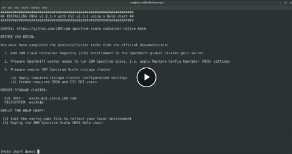

# IBM Spectrum Scale Container Native - Helm

Helm chart to deploy IBM Spectrum Scale® Container Native with CSI driver on Red Hat® OpenShift®

## Helm charts

*Helm charts* allow to separate the *configurable parameters* from the *YAML manifests* of the individual components
and help to simplify and automate the deployment of containerized applications. 
The default [values.yaml](helm/ibm-spectrum-scale/values.yaml) file is part of the Helm chart 
and contains all customizable parameters with their default values for the application.

An administrator only has to edit *one central configuration file* to configure and customize the whole deployment 
without touching any of the YAML manifests of the application. 
It combines all customizable parameters, can easily be reused, or even automatically be created 
in automation scripts with just the minimum set of configuration parameters needed.

Helm chart deployments can be customized with a single *configuration file* (YAML format)
```
# helm install <release name> <Helm chart> -f <configuration file> -n <release namespace>
```
and/or with specifying just the required configuration parameters directly on the command line: 
```
# helm install <release name> <Helm chart> --set <config-key1>=<config-value1>,<config-key2>=<config-value2> -n <release namespace>
```

## Helm chart for IBM Spectrum Scale Container Native

This repository provides a sample *Helm chart* for the deployment of
- [*IBM Spectrum Scale Container Native Storage Access* (CNSA) v5.1.1.4](https://www.ibm.com/docs/en/scalecontainernative?topic=spectrum-scale-container-native-storage-access-5114) with 
- [*IBM Spectrum Scale CSI driver* v2.3.1](https://www.ibm.com/docs/en/spectrum-scale-csi?topic=spectrum-scale-container-storage-interface-driver-231) 

using a *single* configuration file ([*config.yaml*](config.yaml) - a copy of [values.yaml](helm/ibm-specrum-scale/values.yaml)) separated from the YAML manifests. 

The Helm chart comes with its own [README.md](helm/ibm-spectrum-scale/README.md) as a *quick start guide* on how to install it. 

It is based on the original YAML manifests that can be found at the public IBM Github repositories:
- [IBM Spectrum Scale container native](https://github.com/IBM/ibm-spectrum-scale-container-native)
- [IBM Spectrum Scale CSI](https://github.com/IBM/ibm-spectrum-scale-csi)

**Note**: This Helm chart is *not supported* by the IBM Spectrum Scale Container Native nor CSI offerings and 
is outside the scope of the IBM PMR process.
For the official documentation of the deployment of *IBM Spectrum Scale Container Native Storage Access*, 
please refer to the official [IBM Documentation](https://www.ibm.com/docs/en/scalecontainernative).

The Helm chart is only intended to provide ease of use for an *initial* deployment (`helm install`) of 
IBM Spectrum Scale® Container Native Storage Access (CNSA) with IBM Spectrum Scale® CSI driver on Red Hat® OpenShift®
for *Proof of Concepts (PoCs)*, *demos* or any other types of *evaluation* where no further lifecycle management 
and upgrade paths are considered. It is explicitly not intended and not supported for any production use.

You can also generate a final YAML manifest from the Helm chart and the customized configuration file
([*config.yaml*](config.yaml)) with `helm template` and compare the output to the official YAML manifests 
that you would have edited and applied manually when following the official deployment steps 
in the [IBM Documentation](https://www.ibm.com/docs/en/scalecontainernative).
With `helm template [...] | oc apply -f` you can even apply the templated manifests from the Helm chart
to OpenShift with the convenience of Helm charts but without any further dependencies on Helm itself. This is similar 
to the manual deployment of the official YAML manifests as it would not be deployed as an active Helm chart.
Refer to the section 
[*Deploy IBM Spectrum Scale CNSA and CSI driver using Helm chart templating*](INSTALL.md#deploy-ibm-spectrum-scale-cnsa-and-csi-driver-using-helm-chart-templating)
in [*INSTALL.md*](INSTALL.md) for more details about this deployment option.

Note, that the Helm chart does _not support_ any lifecycle management of IBM Spectrum Scale Container Native Storage Access
and IBM Spectrum Scale CSI driver, especially, the `helm upgrade|rollback|uninstall` features are _not supported_ 
and are not expected to work. 
You would need to follow the official IBM documentation to perform any changes or upgrades to the deployment.

Future releases of IBM Spectrum Scale Container Native Storage Access (CNSA) and IBM Spectrum Scale CSI driver 
may come with different packaging and deployment options or upgrade strategies 
and may no longer be suitable for a Helm chart deployment at which point this Helm chart will be discontinued.

With the release of IBM Spectrum Scale Container Native Storage Access v5.1.1.3 the deployment of 
IBM Spectrum Scale CSI driver was integrated into the CNSA deployment. 
So now, there is only *one* Helm chart to deploy IBM Spectrum Scale Container Native Storage Access with
IBM Spectrum Scale CSI driver.

## Example manifests for dynamic volume provisioning

The repository also provides a directory [examples/](examples) with sample YAML manifests 
to quickly get started with *dynamic provisioning* of *persistent volumes* (PVs) in OpenShift/Kubernetes.
It contains samples to create a *storage class* (SC), a *persistent volume claim* (PVC) as well as a *test pod* 
which is writing a time-stamp in 5-second intervals into the mounted volume: 
- [*ibm-spectrum-scale-sc.yaml*](examples/ibm-spectrum-scale-sc.yaml) (storage class, fileset based, used for the PVC and test-pod)
- [*ibm-spectrum-scale-light-sc.yaml*](examples/ibm-spectrum-scale-light-sc.yaml) (storage class, lightweight / directory based)
- [*ibm-spectrum-scale-pvc.yaml*](examples/ibm-spectrum-scale-pvc.yaml) (persistent volume claim / PVC) 
- [*ibm-spectrum-scale-test-pod.yaml*](examples/ibm-spectrum-scale-test-pod.yaml) (test pod using a Red Hat *ubi8/ubi-minimal* image)

The sample manifests allow to run a quick *sanity check* of your deployment with a full cycle of *dynamic storage provisioning* 
with IBM Spectrum Scale CNSA/CSI. For further details, please refer to 
[Example of using storage provisioning with IBM Spectrum Scale](INSTALL.md#example-of-using-storage-provisioning-with-ibm-spectrum-scale).

## Installation

Once all prerequisites are met the Helm chart deployment only requires the following steps:
1. Edit the [*config.yaml*](config.yaml) file to reflect your local configuration.
2. Deploy the IBM Spectrum Scale CNSA Helm chart ([*ibm-spectrum-scale*](helm/ibm-spectrum-scale)).

The Helm chart can also create the Kubernetes *secrets* for the CNSA and CSI users automatically. 
Furthermore, it uses *hooks* to test proper access to the GUI of the remote storage cluster 
with the provided credentials (or secrets) prior to starting the actual deployment. 

For a *quick start guide* on how to install it, please refer to the [README.md](helm/ibm-spectrum-scale/README.md). 
provided with the Helm chart.

For detailed instructions of the whole deployment including the required pre-installation tasks, please see 
[*Helm Chart Deployment of IBM Spectrum Scale CNSA/CSI*](INSTALL.md) in the [INSTALL.md](INSTALL.md) document.

Watch the video to see the Helm chart deployment in action:

[](https://ibm.box.com/s/kxh2p0shesh6u7b5w2f5hw74lq7p12iv)

## Disclaimer

These Helm charts are provided on an "AS IS" BASIS, 
WITHOUT WARRANTIES OR CONDITIONS OF ANY KIND, either express or
implied, including, without limitation, any warranties or conditions
of TITLE, NON-INFRINGEMENT, MERCHANTABILITY, or FITNESS FOR A
PARTICULAR PURPOSE. You are solely responsible for determining the
appropriateness of using or redistributing the Work and assume any
risks associated with Your exercise of permissions under this License.

## Repository tags and releases

The *main* branch in this Github repository will carry tags to refer to different releases of these Helm charts for the 
combined deployment of specific *IBM Spectrum Scale CNSA* and *IBM Spectrum Scale CSI driver* releases.

- Tag v5.1.1.4-v2.3.1:<br>
  Helm chart for IBM Spectrum Scale CNSA v5.1.1.4 with IBM Spectrum Scale CSI driver v2.3.1 (w/hooks to check proper GUI access)
- Tag v5.1.1.1-v2.2.0-up1:<br>
  Helm charts for IBM Spectrum Scale CNSA v5.1.1.1 and IBM Spectrum Scale CSI driver v2.2.0 (w/hooks to check proper GUI access)
- Tag v5.1.1.1-v2.2.0:<br>
  Helm charts for IBM Spectrum Scale CNSA v5.1.1.1 and IBM Spectrum Scale CSI driver v2.2.0
- Tag v5.1.0.3-v2.2.0:<br> 
  Helm charts for IBM Spectrum Scale CNSA v5.1.0.3 and IBM Spectrum Scale CSI driver v2.2.0
- Tag v5.1.0.3-v2.1.0:<br> 
  Helm charts for IBM Spectrum Scale CNSA v5.1.0.3 and IBM Spectrum Scale CSI driver v2.1.0

## Support

The Helm charts for IBM Spectrum Scale container native and CSI are meant to assist with installation 
but are not a formally supported offering by IBM. These are not supported by 
the IBM Spectrum Scale container native nor CSI offerings and are outside the scope of the IBM PMR process. 

For supported methods of installation, please refer to the IBM Documentation for each product:
- [IBM Spectrum Scale CSI documentation](https://www.ibm.com/docs/en/spectrum-scale-csi)
- [IBM Spectrum Scale container native documentation](https://www.ibm.com/docs/en/scalecontainernative)

## Report Bugs 

For non-urgent issues, suggestions, recommendations, feel free to open an issue in 
[github](https://github.com/IBM/ibm-spectrum-scale-container-native-helm/issues).
Issues will be addressed as team availability permits.

## Contributing

We welcome contributions to this project, see [Contributing](CONTRIBUTING.md) for more details.

##### Note: This repository includes contributions from:

- [Spectrum Scale CSI](https://github.com/IBM/ibm-spectrum-scale-csi)
- [Spectrum Scale container native](https://github.com/IBM/ibm-spectrum-scale-container-native)

## Licensing

Copyright 2021 IBM Corp.

Licensed under the Apache License, Version 2.0 (the "License");
you may not use this file except in compliance with the License.
You may obtain a copy of the License at

http://www.apache.org/licenses/LICENSE-2.0

Unless required by applicable law or agreed to in writing, software
distributed under the License is distributed on an "AS IS" BASIS,
WITHOUT WARRANTIES OR CONDITIONS OF ANY KIND, either express or implied.
See the License for the specific language governing permissions and
limitations under the License.
